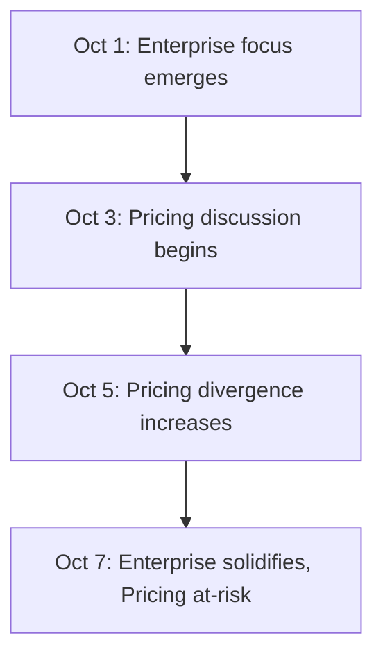

# `strategy-compounder`

**Version**: 1.0.0  
**Summary**: Track strategic evolution across sessions - quantitative scoring and diff analysis

---

## Purpose

The Strategy Compounder analyzes strategic partner sessions over time to track how your strategy evolves. It's your **strategic intelligence layer** that:

**What it does:**
- **Quantitative tracking** - Scores consensus, divergence, trajectory
- **Diff analysis** - Compares new themes vs. baseline strategy
- **Heat zones** - Emerging, Solidifying, Locked-In, At-Risk
- **Cohesion assessment** - Measures strategic alignment
- **Evolution timeline** - Visual map of strategic shifts
- **Pattern detection** - Cross-session themes and contradictions

**What it is NOT:**
- Not a replacement for sessions (it analyzes them)
- Not real-time (runs periodically or on-demand)
- Not prescriptive (it describes, you decide)

---

## Usage

### Basic: Analyze Last Week

```bash
strategy-compounder --period week
```

Analyzes all strategic partner sessions from past 7 days.

### Basic: Analyze Last Month

```bash
strategy-compounder --period month
```

Analyzes sessions from past 30 days.

### Advanced: Compare to Baseline

```bash
strategy-compounder --baseline Knowledge/hypotheses/gtm_hypotheses.md --period week
```

Compares recent sessions against baseline strategy document.

### Advanced: Full Evolution Report

```bash
strategy-compounder --full-report
```

Generates comprehensive evolution report with all heat zones, diffs, cohesion scores.

---

## Key Concepts

### 1. Consensus Score (Recency-Weighted)

**What it measures:** How often a theme appears, weighted by recency

**Formula:** Exponential decay weighting (λ = 0.1)

**Example:**
- Theme "Enterprise focus" mentioned in 5 sessions
- More recent mentions weighted higher
- Consensus = 0.85 (high)

**Interpretation:**
- **0.8-1.0:** Strong consensus
- **0.5-0.8:** Moderate consensus
- **0.0-0.5:** Weak consensus

### 2. Divergence Score

**What it measures:** Conflict/contradiction within a theme

**Formula:** |support – conflict| ÷ total mentions

**Example:**
- "Pricing increase" mentioned 10 times
- 7 times supportive, 3 times cautious
- Divergence = |7-3|/10 = 0.4 (moderate)

**Interpretation:**
- **0.0-0.3:** Low divergence (aligned)
- **0.3-0.6:** Moderate divergence (discussion needed)
- **0.6-1.0:** High divergence (major conflict)

### 3. Trajectory

**What it measures:** Change in consensus over time

**Formula:** Δ Consensus between windows (current vs. previous)

**Example:**
- Week 1: Consensus = 0.6
- Week 2: Consensus = 0.8
- Trajectory = +0.2 (rising)

**Interpretation:**
- **> +0.15:** Rapidly solidifying
- **-0.05 to +0.15:** Stable
- **< -0.15:** Weakening

### 4. Heat Zones

**Strategic themes classified by state:**

#### **Emerging** (New, gaining momentum)
- Low consensus (< 0.5)
- Positive trajectory (> +0.1)
- Low divergence (< 0.3)
- **Action:** Watch closely, may become priority

#### **Solidifying** (Building alignment)
- Moderate consensus (0.5-0.8)
- Positive or stable trajectory
- Low-moderate divergence
- **Action:** Continue building case, track progress

#### **Locked-In** (Strategic commitment)
- High consensus (> 0.8)
- Stable trajectory
- Low divergence (< 0.3)
- **Action:** Execute, less discussion needed

#### **At-Risk** (Conflict or weakening)
- Any consensus level
- Negative trajectory (< -0.1)
- OR high divergence (> 0.6)
- **Action:** Address immediately, resolve conflicts

### 5. Cohesion Index

**What it measures:** Overall strategic alignment

**Formula:** Harmonic mean of Consensus and (1 – Divergence)

**Range:** 0.0 to 1.0

**Interpretation:**
- **0.7-1.0:** Healthy cohesion
- **0.5-0.7:** Moderate cohesion (some tension)
- **0.0-0.5:** Low cohesion (strategic misalignment)

### 6. Strategic Diff Tags

**Compares new themes to baseline strategy:**

- **Amplifies:** Reinforces existing strategy with more evidence
- **Reinforces:** Consistent with existing strategy
- **Deviates:** Contradicts or shifts from baseline
- **New:** Not present in baseline strategy

**Each tagged with magnitude (Low/Medium/High)**

---

## Outputs

### 1. Strategy Evolution Narrative

**Format:** Prose summary

```markdown
# Strategic Evolution Report
## Period: October 1-7, 2025

### Executive Summary
Your strategy shows strong cohesion (0.78) with 3 emerging themes and 1 
at-risk area requiring attention. Enterprise focus is solidifying while 
pricing strategy shows increasing divergence.

### Theme Analysis

**Enterprise Focus** (Locked-In)
- Consensus: 0.89 | Divergence: 0.12 | Trajectory: +0.05
- Status: Strong alignment, execution phase
- Baseline: Amplifies existing GTM strategy (High)
- Mentioned: 7 sessions, all supportive
- Recommendation: Proceed with enterprise pilot

**Pricing 30% Increase** (At-Risk)
- Consensus: 0.62 | Divergence: 0.71 | Trajectory: -0.15
- Status: High conflict, weakening support
- Baseline: Deviates from conservative pricing approach (Medium)
- Mentioned: 5 sessions, 3 supportive, 2 concerned
- Recommendation: Address concerns before proceeding

[etc...]
```

### 2. Strategic Diff Table

**Format:** Markdown table

| Theme | Consensus | Divergence | Trajectory | Heat Zone | Baseline Diff | Magnitude |
|-------|-----------|------------|------------|-----------|---------------|-----------|
| Enterprise focus | 0.89 | 0.12 | +0.05 | Locked-In | Amplifies | High |
| Pricing increase | 0.62 | 0.71 | -0.15 | At-Risk | Deviates | Medium |
| Product roadmap | 0.73 | 0.28 | +0.12 | Solidifying | Reinforces | Low |
| Partnership model | 0.45 | 0.22 | +0.18 | Emerging | New | - |

### 3. Heat Map Visualization

**Format:** Markdown table

```
HEAT MAP - Strategic Themes by Zone

🟢 Locked-In (Execute)
  • Enterprise focus (0.89)
  • B2C channel strategy (0.82)

🟡 Solidifying (Monitor)
  • Product roadmap Q1 (0.73)
  • Hiring priorities (0.68)

🔵 Emerging (Watch)
  • Partnership model (0.45)
  • Content strategy (0.38)

🔴 At-Risk (Address)
  • Pricing 30% increase (0.62, high divergence)
```

### 4. Cohesion Assessment

**Format:** Prose + score

```markdown
## Strategic Cohesion Assessment

Overall Cohesion Index: 0.78 (Healthy)

Your strategic discussions show strong alignment on core themes (enterprise, 
product, hiring) with clear consensus emerging over the past 2 weeks. The 
primary tension point is pricing strategy, where divergence has increased from 
0.3 to 0.71, indicating unresolved concerns.

Recommendation: Schedule focused session on pricing to address concerns before 
they impact other strategic initiatives.
```

### 5. Timeline Visualization

**Format:** Mermaid diagram



### 6. Outstanding Questions

**Format:** Markdown list (ranked by importance)

```markdown
## Unresolved Strategic Questions

### High Priority
1. **Pricing validation** (Divergence: 0.71, mentioned 5x)
   - What's the customer willingness-to-pay data?
   - What's the churn risk model?
   
2. **Enterprise vs. SMB focus** (Divergence: 0.54, mentioned 7x)
   - Are we building for enterprise or SMB?
   - What's the resource allocation split?

### Medium Priority
[...]
```

---

## Integration with N5 OS

### With Strategic Partner

**Automatic tracking:**
- Every strategic partner session analyzed
- Themes extracted automatically
- Scores updated incrementally
- No manual input required

### With Weekly Review

**Feeds into weekend review:**
- Heat zones surface in review
- At-risk themes flagged
- Outstanding questions included
- Cohesion trends shown

### With Knowledge Base

**Baseline comparison:**
- Reads hypotheses files (read-only)
- Compares themes to baseline
- Tags diffs (Amplifies/Reinforces/Deviates/New)
- Stages update proposals (human approval required)

### With Reflection Synthesizer

**Cross-session synthesis:**
- Aggregates insights from multiple sessions
- Tracks theme evolution
- Identifies contradictions across time
- Measures strategic shifts

---

## Use Cases

### Use Case 1: Monthly Strategy Review

```bash
# End of month
strategy-compounder --period month --baseline Knowledge/hypotheses/gtm_hypotheses.md
```

**Output:**
- Comprehensive evolution report
- All heat zones mapped
- Cohesion assessment
- Diff from baseline strategy
- Recommended focus areas

**Use for:**
- Board updates
- Team alignment
- Strategy refinement
- Priority setting

### Use Case 2: Pre-Decision Analysis

```bash
# Before major decision
strategy-compounder --theme "pricing strategy" --period 2weeks
```

**Output:**
- Focused analysis on single theme
- Consensus evolution
- Divergence points identified
- Stakeholder alignment shown

**Use for:**
- Decision validation
- Conflict identification
- Support assessment

### Use Case 3: Weekly Health Check

```bash
# Every Monday morning
strategy-compounder --period week --quick
```

**Output:**
- Brief summary (1 page)
- Heat zones only
- At-risk themes flagged
- Cohesion score

**Use for:**
- Quick strategic health check
- Early warning system
- Weekly planning input

---

## When to Run

### Automatic (Scheduled)

**Weekly:** Every Sunday 6 PM ET
- Analyzes past week
- Generates brief report
- Flags at-risk themes
- Feeds into Monday planning

**Monthly:** Last day of month, 6 PM ET
- Comprehensive analysis
- Full evolution report
- All visualizations
- Strategic health assessment

### On-Demand

**Before major decisions:**
```bash
strategy-compounder --theme "partnership strategy"
```

**After significant sessions:**
```bash
strategy-compounder --since last-run
```

**Quarterly reviews:**
```bash
strategy-compounder --period quarter --full-report
```

---

## Configuration

### Window Size (Sliding Window)

**Default:** Last 10 sessions OR 30 days (whichever includes more sessions)

**Override:**
```bash
strategy-compounder --window 15sessions
strategy-compounder --window 45days
```

### Decay Factor (λ)

**Default:** λ = 0.1 (moderate recency bias)

**Override:**
```bash
strategy-compounder --decay 0.05  # Less recency bias
strategy-compounder --decay 0.2   # More recency bias
```

### Consensus Threshold

**Default:** 0.8 for "Locked-In" classification

**Override:**
```bash
strategy-compounder --consensus-threshold 0.75
```

---

## Quality Standards

### Theme Merge Precision

**Target:** ≥ 90%

Synonyms correctly merged (e.g., "enterprise" + "corporate" = same theme)

### Consensus Stability

**Target:** σ < 0.1

Scores should be stable across similar time windows.

### Diff Tag Accuracy

**Target:** ≥ 90%

Baseline comparison tags (Amplifies/Reinforces/etc.) correctly applied.

### Divergence Detection Recall

**Target:** ≥ 85%

Conflicts and contradictions identified.

### Cohesion Index

**Target:** ≥ 0.6 (Healthy)

Overall strategic alignment measurement.

---

## Technical Details

**State Management:**
- Persistent state file: `N5/strategy-evolution/state.json`
- Updated incrementally
- Rolling window maintained
- Theme clustering (cosine ≥ 0.85)

**Theme Extraction:**
- Analyzes strategic partner sessions
- Extracts themes, decisions, goals
- Clusters synonyms
- Aligns to baseline topics

**Scoring:**
- Exponential decay weighting
- Consensus calculation
- Divergence measurement
- Trajectory tracking
- Cohesion computation

**Visualization:**
- Mermaid timeline generation
- Heat map tables
- Markdown formatting

---

## Safety Features

### Knowledge Write Protection 🔒
- Reads baseline strategy (read-only)
- Proposes updates based on evolution
- Human approval required

### Non-Prescriptive Analysis 📊
- Describes patterns, doesn't dictate
- You interpret and decide
- Flags tensions, doesn't resolve them

### Privacy & Context 🔐
- Analyzes only strategic partner sessions
- No external data collection
- All processing local

---

## Related Commands

- `strategic-partner` - Generate sessions that Strategy Compounder analyzes
- `weekly-strategic-review` - Uses Strategy Compounder insights
- `idea-compounder` - Generate deep thinking that Strategy Compounder tracks

---

## Notes

The Strategy Compounder is **Phase 2 (Supporting Function)** - the meta-level intelligence layer.

**Key principle:** Strategy doesn't evolve in single sessions. It emerges across multiple dialogues, shifts gradually, and benefits from quantitative tracking.

The Strategy Compounder provides that bird's-eye view - showing where you're building consensus, where conflicts exist, and how your thinking is evolving over time.

**It's not a replacement for strategic thinking - it's strategic pattern recognition at scale.**

---

*The Strategy Compounder: Where strategic sessions become strategic intelligence.*
