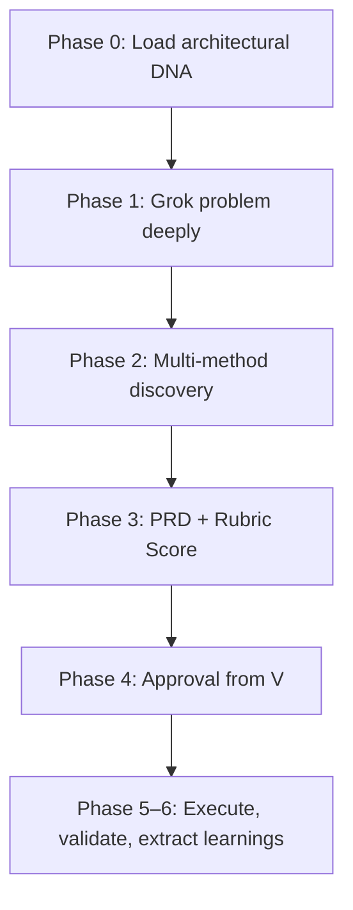

# Pre-Build Discovery & PRD Protocol

```yaml
capability_id: pre-build-discovery-prd-protocol
name: "Pre-Build Discovery & PRD Protocol"
category: workflow
status: active
confidence: medium
last_verified: 2025-11-29
tags:
  - build
  - planning
  - discovery
  - prd
entry_points:
  - type: prompt
    id: "Prompts/pre-build-checklist.prompt.md"
owner: "V"
```

## What This Does

Implements a **grok-first discovery and PRD workflow** for any significant build or refactor. Forces deep understanding, multi-method discovery, structured PRD creation, scoring via a quality rubric, and explicit approval before execution to prevent "vibe coding" and duplicated systems.

## How to Use It

- Before building/refactoring systems, especially when the change is large, ambiguous, or cross-cutting:
  - Load `file 'Prompts/pre-build-checklist.prompt.md'` in the build conversation.
  - Complete PHASE 0 (architectural DNA + SESSION_STATE init).
  - Work through PHASE 1–3 to grok the problem, perform file/system discovery, and generate a full PRD.
  - Score the PRD using the rubric (target ≥8.0/10 overall).
  - Present the approval package to V and **wait for explicit approval** before coding.

## Associated Files & Assets

- `file 'Prompts/pre-build-checklist.prompt.md'` – full protocol and rubric
- `file 'Knowledge/architectural/planning_prompt.md'` – loaded in Phase 0
- `file 'N5/scripts/session_state_manager.py'` – SESSION_STATE initialization
- `file 'N5/scripts/executable_manager.py'` – discovery of registered executables
- `tool list_scheduled_tasks` – discovery of existing scheduled tasks

## Workflow



## Notes / Gotchas

- This protocol is **mandatory** for big builds, refactors >50 lines, schema changes, and multi-file operations.
- Execution without completing discovery/PRD phases is a process violation and tends to produce duplicate or brittle systems.
- The rubric is not optional bureaucracy; it encodes hard-won lessons about quality and is used to track reasoning patterns over time.

