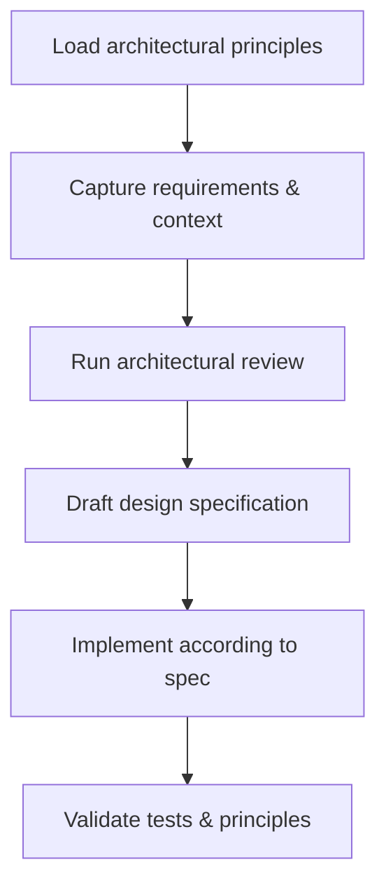

# System Design Workflow

```yaml
capability_id: system-design-workflow
name: "System Design Workflow"
category: workflow
status: active
confidence: medium
last_verified: 2025-11-29
tags:
  - architecture
  - design
  - planning
  - system-change
entry_points:
  - type: prompt
    id: "Prompts/System Design Workflow.prompt.md"
  - type: script
    id: "N5/commands/system-design-workflow.md"
owner: "V"
```

## What This Does

Standardizes how major system changes are **designed before implementation**. Guides V and personas through loading architectural principles, clarifying requirements, performing architectural review, drafting a design spec, and validating against principles before building or refactoring.

## How to Use It

- Before any significant system change (new scripts, refactors, infra changes), load `@System Design Workflow`.
- Follow the phases in `file 'Prompts/System Design Workflow.prompt.md'`:
  - Phase 0: Load architectural principles.
  - Phase 1: Requirements & context.
  - Phase 2: Architectural review against principles.
  - Phase 3: Design specification.
  - Phase 4–5: Implementation + validation.
- Use the command description `file 'N5/commands/system-design-workflow.md'` (if present) for a concise, script-friendly version of the workflow.

## Associated Files & Assets

- `file 'Prompts/System Design Workflow.prompt.md'` – primary workflow definition
- `file 'Knowledge/architectural/architectural_principles.md'` – core principles (compatibility shell)
- `file 'Personal/Knowledge/Architecture/principles/architectural_principles.md'` – canonical principles
- `file 'Knowledge/architectural/planning_prompt.md'` – planning discipline
- `file 'N5/prefs/prefs.md'` – user/system preferences

## Workflow



## Notes / Gotchas

- This workflow is **mandatory** for large builds and refactors per user rules.
- Skipping the principle-loading phase leads to architectural drift; always start at Phase 0.
- For net-new systems, combine this workflow with the **Pre-Build Discovery & PRD Protocol** for deeper discovery and PRD-level documentation.

