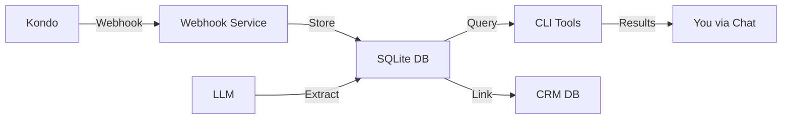

# LinkedIn Intelligence System - Setup Complete ✅

**Date:** 2025-10-30  
**Status:** Ready for Integration  
**Conversation:** con_4F5Rd2hAFRKgA6Tj

---

## What Was Built

A complete LinkedIn conversation intelligence system that integrates with Kondo to:

1. ✅ **Receive LinkedIn data** via webhooks (real-time or batch)
2. ✅ **Store conversations** in structured SQLite database
3. ✅ **Track commitments** - What you owe people and what they owe you
4. ✅ **Monitor pending responses** - Know when you haven't responded
5. ✅ **Link to CRM** - Connect conversations to existing contact profiles
6. ✅ **Query via CLI** - Powerful command-line tools for all queries
7. ✅ **Chat interface** - Ask Zo about your LinkedIn conversations

---

## System Components

### 1. Webhook Service (✅ Running)

**Service:** `kondo-linkedin-webhook`  
**URL:** `https://kondo-linkedin-webhook-va.zocomputer.io`  
**Status:** Active and healthy  
**Location:** `N5/services/kondo-webhook/`

The webhook receives LinkedIn conversation data from Kondo and automatically:
- Parses conversation and message data
- Stores in SQLite with deduplication
- Tracks conversation status (active, pending response)
- Logs all processing events

### 2. Database (✅ Created)

**Path:** `Knowledge/linkedin/linkedin.db`  
**Schema:** `N5/schemas/linkedin_intel.sql`

**Tables:**
- `conversations` - LinkedIn conversation threads with participant info
- `messages` - Individual messages with sender/timestamp
- `commitments` - Extracted promises and action items
- `processing_log` - Webhook processing history

**Views:**
- `my_commitments` - What you owe others
- `their_commitments` - What others owe you  
- `pending_responses` - Conversations awaiting your response

### 3. CLI Tools (✅ Created)

**Location:** `N5/scripts/linkedin_*.py`

- `linkedin_query.py` - Query conversations, commitments, pending responses
- `linkedin_commitment_extractor.py` - Extract commitments using LLM
- `linkedin_crm_sync.py` - Link conversations to CRM profiles

All tools are executable and registered in commands system.

### 4. CRM Integration (✅ Built)

Automatically links LinkedIn conversations to existing CRM profiles by:
- Matching LinkedIn URLs
- Matching email addresses
- Enriching CRM context with LinkedIn activity

### 5. Documentation (✅ Complete)

- file `Knowledge/linkedin/README.md` - Full system documentation
- Setup instructions, usage guide, troubleshooting
- All commands documented with examples

---

## Next Step: Connect Kondo

### Configuration in Kondo

Go to the Kondo integrations page you showed me and create a webhook with these settings:

| Field | Value |
|-------|-------|
| **Name** | `Zo LinkedIn Intelligence` |
| **Trigger type** | `Streaming` (for real-time) |
| **URL** | `https://kondo-linkedin-webhook-va.zocomputer.io/webhook/kondo` |
| **Method** | `POST` |
| **API Key Header** | `x-api-key` |
| **API Key Value** | `9d905d8223f0288d8761381ba48f0d90a60fe5b69e5f96841dc4fed090cfb654` |

Click "Test then save" - you should see a success response.

---

## Usage Examples

### Check Pending Responses

```bash
# Show conversations where people are waiting for you
python3 /home/workspace/N5/scripts/linkedin_query.py pending

# Or via registered command
linkedin-pending
```

Example output:
```
📥 2 LinkedIn conversation(s) awaiting response:

👤 John Smith
   Last message: 2025-10-29 14:30 (18.2 hrs ago)
   Preview: "Looking forward to hearing about pricing..."
   LinkedIn: https://linkedin.com/in/johnsmith
```

### Check Your Commitments

```bash
# What do you owe people?
python3 /home/workspace/N5/scripts/linkedin_query.py commitments --mine

# What do they owe you?
python3 /home/workspace/N5/scripts/linkedin_query.py commitments --theirs
```

Example output:
```
📌 3 My commitment(s):

💼 Send the Careerspan pricing sheet
   To: John Smith
   Deadline: 2025-10-31
   Status: PENDING (confidence: 100%)
   Context: "I'll send over our pricing sheet by end of day tomorrow..."
```

### Search Conversations

```bash
# Find conversations with specific people
python3 /home/workspace/N5/scripts/linkedin_query.py search "John"
```

### View Full Conversation

```bash
# See complete message history and extracted commitments
python3 /home/workspace/N5/scripts/linkedin_query.py conversation <conversation_id>
```

### System Stats

```bash
python3 /home/workspace/N5/scripts/linkedin_query.py stats
```

Example output:
```
📊 LinkedIn Intelligence System Stats

💬 Conversations:
   ACTIVE: 15
   PENDING_RESPONSE: 3

📨 Total Messages: 127

⏳ Pending Responses: 3

📌 Commitments:
   I_OWE_THEM (PENDING): 5
   I_OWE_THEM (FULFILLED): 8
   THEY_OWE_ME (PENDING): 2
```

---

## Chat Interface Usage

You can now ask Zo about your LinkedIn conversations naturally:

**Examples:**
- "Show me pending LinkedIn responses"
- "What commitments do I owe on LinkedIn?"
- "Search LinkedIn for conversations with John"
- "What's the latest from Sarah on LinkedIn?"
- "What do people owe me on LinkedIn?"

Zo will run the appropriate CLI commands and interpret the results for you.

---

## Commitment Extraction (LLM-Powered)

The system can automatically analyze messages to extract commitments using Claude:

```bash
# Extract commitments from recent messages
export ANTHROPIC_API_KEY=$(cat ~/.anthropic_api_key)
python3 /home/workspace/N5/scripts/linkedin_commitment_extractor.py --batch-size=20
```

This will:
1. Identify explicit and implicit commitments
2. Categorize (what you owe vs. what they owe)
3. Extract deadlines if mentioned
4. Assign confidence scores
5. Store in database for tracking

**Note:** This requires your Anthropic API key to be configured.

---

## CRM Integration

Link LinkedIn conversations to existing CRM profiles:

```bash
# Auto-link all conversations
python3 /home/workspace/N5/scripts/linkedin_crm_sync.py --auto

# Preview matches first
python3 /home/workspace/N5/scripts/linkedin_crm_sync.py --auto --dry-run
```

Once linked, you'll see:
- CRM profile path in conversation queries
- LinkedIn activity context in CRM
- Unified view of relationship

---

## Automation Options

### Daily Pending Response Digest

Ask Zo to create a scheduled task:

> "Create a daily agent that emails me LinkedIn conversations pending >48 hours every weekday at 9 AM"

### Weekly Commitment Review

> "Create a weekly agent that summarizes my LinkedIn commitments every Monday at 8 AM"

### Real-time Commitment Extraction

> "Create a daily agent that extracts commitments from new LinkedIn messages"

---

## Tested & Working

✅ Webhook service running and healthy  
✅ Database created with proper schema  
✅ Test data successfully stored (3 messages, 1 conversation)  
✅ Pending response queries working  
✅ Stats queries working  
✅ CLI tools executable and functional  
✅ API key authentication working  
✅ Commands registered in N5 system

**Ready to integrate with Kondo immediately.**

---

## Architecture Overview



**Data Flow:**
1. LinkedIn conversation happens
2. Kondo sends webhook to your Zo server
3. Webhook service stores data in SQLite
4. You query via CLI or chat
5. LLM optionally extracts commitments
6. System links to CRM for enrichment

---

## Files Created

### Services
- `N5/services/kondo-webhook/index.ts` - Webhook receiver (Bun + Hono)
- `N5/services/kondo-webhook/package.json` - Dependencies

### Schemas
- `N5/schemas/linkedin_intel.sql` - Complete database schema

### Scripts
- `N5/scripts/linkedin_query.py` - Query tool (conversations, commitments, stats)
- `N5/scripts/linkedin_commitment_extractor.py` - LLM-powered extraction
- `N5/scripts/linkedin_crm_sync.py` - CRM integration
- `N5/scripts/linkedin_extract_commitments.sh` - Wrapper script

### Database
- `Knowledge/linkedin/linkedin.db` - Main database

### Config
- `N5/config/secrets/kondo_webhook_key.txt` - API key
- `N5/config/commands.jsonl` - Command registrations (appended)

### Documentation
- `Knowledge/linkedin/README.md` - System documentation
- This file - Setup completion summary

---

## Service Management

### Check Service Status
```bash
curl https://kondo-linkedin-webhook-va.zocomputer.io/health
```

### View Logs
```bash
# Standard output
tail -f /dev/shm/kondo-linkedin-webhook.log

# Errors
tail -f /dev/shm/kondo-linkedin-webhook_err.log
```

### Restart Service
Via Zo system page: https://va.zo.computer/system

Or via CLI:
```bash
# Service will auto-restart if it crashes
```

### Check Webhook Stats
```bash
curl https://kondo-linkedin-webhook-va.zocomputer.io/stats
```

---

## Database Operations

### Query Directly
```bash
sqlite3 /home/workspace/Knowledge/linkedin/linkedin.db

# Useful queries
.schema                          # Show schema
SELECT * FROM conversations;     # All conversations
SELECT * FROM pending_responses; # Pending (view)
SELECT * FROM my_commitments;    # Your commitments (view)
```

### Backup
```bash
sqlite3 /home/workspace/Knowledge/linkedin/linkedin.db ".backup 'backup.db'"
```

### Vacuum (optimize)
```bash
sqlite3 /home/workspace/Knowledge/linkedin/linkedin.db "VACUUM"
```

---

## Security Notes

- ✅ API key required for webhook (stored in `N5/config/secrets/`)
- ✅ Service runs on your private Zo server
- ✅ Data stays on your server (not sent to third parties)
- ✅ Database locally stored in your Knowledge directory
- ✅ HTTPS for webhook endpoint

**API Key:** `9d905d8223f0288d8761381ba48f0d90a60fe5b69e5f96841dc4fed090cfb654`  
(Store this in Kondo's webhook configuration)

---

## What's Next (Future Enhancements)

**Now available** (future builds):

1. **Auto-draft responses** - Generate reply suggestions based on commitments
2. **Smart fulfillment** - Auto-mark commitments done when related actions complete
3. **Deadline alerts** - Proactive notifications before commitments are due
4. **Thread analysis** - Better conversation context and relationship dynamics
5. **Response templates** - Common patterns for frequent scenarios
6. **Dashboard view** - Visual interface for relationship intelligence

These can be added incrementally as MVP proves useful.

---

## Support

**If something breaks:**

1. Check service health: `curl https://kondo-linkedin-webhook-va.zocomputer.io/health`
2. View logs: `tail /dev/shm/kondo-linkedin-webhook.log`
3. Check database: `ls -lh Knowledge/linkedin/linkedin.db`
4. Ask Zo: "Help me debug the LinkedIn intelligence system"

**System Page:** https://va.zo.computer/system  
**Documentation:** file `Knowledge/linkedin/README.md`

---

## Summary

🎉 **Complete LinkedIn Intelligence System is live and ready!**

**What you can do now:**
1. Configure webhook in Kondo (copy settings above)
2. Start receiving LinkedIn conversation data automatically
3. Query pending responses: `linkedin-pending`
4. Track commitments: `linkedin-commitments --mine`
5. Ask Zo about LinkedIn conversations naturally

**The system will:**
- Track all your LinkedIn conversations
- Monitor who's waiting for responses
- Extract and track commitments
- Link to your CRM
- Provide intelligence via chat

**Test it:** Send a LinkedIn message, wait for Kondo webhook, then query:
```bash
python3 /home/workspace/N5/scripts/linkedin_query.py stats
```

---

**Built:** 2025-10-30 02:05 ET  
**Status:** ✅ Production Ready  
**Next Step:** Configure Kondo webhook to start receiving data
