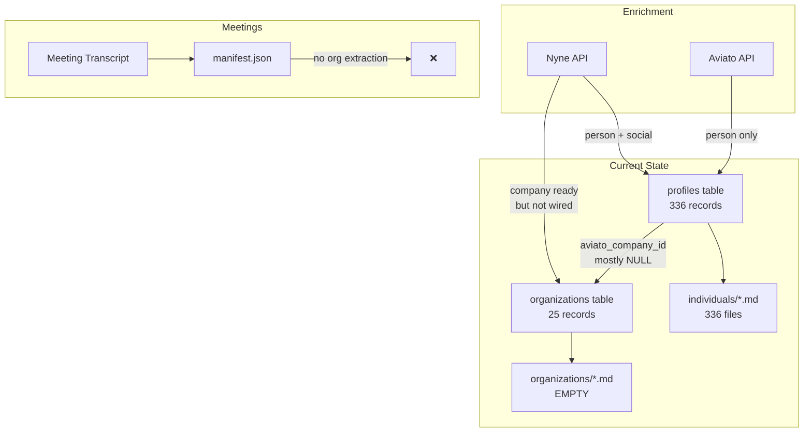

# Organization System Audit

## Executive Summary

The CRM V3 system has **existing but unused org infrastructure**. The database schema is ready, but the markdown profile layer (`organizations/`) is empty and there are no operational workflows connecting orgs to individuals or meetings. This is a "wiring" problem, not a "building" problem.

---

## Part 1: Current State

### 1.1 Database Schema (crm_v3.db)

**Tables Present:**
| Table | Purpose | Row Count |
|-------|---------|-----------|
| `organizations` | Org records | 25 |
| `organization_enrichment_queue` | Enrichment job queue | 0 |
| `profiles` (people) | Individual records | 336+ |

**Organizations Table Schema:**
```sql
CREATE TABLE organizations (
    id INTEGER PRIMARY KEY AUTOINCREMENT,
    name TEXT NOT NULL,
    slug TEXT NOT NULL UNIQUE,  -- Maps to filename
    domain TEXT,
    
    -- Metadata
    source TEXT NOT NULL DEFAULT 'extraction',
    created_at TEXT NOT NULL DEFAULT (datetime('now')),
    updated_at TEXT NOT NULL DEFAULT (datetime('now')),
    
    -- Enrichment State
    enrichment_status TEXT NOT NULL DEFAULT 'pending',
    last_enriched_at TEXT,
    last_enrichment_error TEXT,
    
    -- Aviato Data (Core)
    aviato_id TEXT,
    linkedin_url TEXT,
    description TEXT,
    industry TEXT,
    founded_year INTEGER,
    headcount_range TEXT,
    location TEXT
);
```

**Current Org Data Sample:**
| domain | name | enrichment_status |
|--------|------|-------------------|
| startery.io | Startery.Io | enriched |
| elly.ai | Elly.Ai | pending |
| docsum.ai | Docsum.Ai | pending |
| (null) | Cornell | pending |
| (null) | Personal (gmail.com) | pending |

**Observation:** 24/25 orgs are in `pending` status. Most have no domain.

### 1.2 Profile ↔ Org Linking

**Current State:** The `profiles` table has `aviato_company_id` column, but:
- Field is sparsely populated (most NULL)
- No FK relationship to `organizations` table
- No `organization_slug` field for markdown linking

**Sample JOIN (profiles → organizations):**
```sql
SELECT p.name, p.aviato_company_id, o.name as org_name 
FROM profiles p 
LEFT JOIN organizations o ON p.aviato_company_id = CAST(o.aviato_id AS TEXT);
-- Result: All NULL org_name (no matches)
```

### 1.3 Markdown Layer

**Directory Structure:**
```
Personal/Knowledge/CRM/
├── db/                   # SQLite reference (not used)
├── individuals/          # 336 markdown profiles
├── organizations/        # EMPTY (0 files)
└── views/               # Empty
```

**Individual Profile Example (aaron-mak-hoffman.md):**
```yaml
---
person_id: aaron-mak-hoffman
created: '2025-11-29'
last_edited: '2025-11-29'
---

# Aaron Mak Hoffman

**Organization:** Personal (gmail.com)  # <- String, NOT a link
**Role:** [To be determined]
**Email:** aamak44@gmail.com
```

**Gap:** Organization is a text field, not a `[[wikilink]]` to an org profile.

### 1.4 Enrichment Pipeline

**Existing Infrastructure:**
| Component | Person Support | Company Support |
|-----------|----------------|-----------------|
| `Integrations/Nyne/nyne_client.py` | ✅ `enrich_person()` | ✅ `enrich_company()` |
| `N5/scripts/enrichment/nyne_enricher.py` | ✅ `enrich_person_via_nyne()` | ✅ `enrich_company_via_nyne()` |
| `N5/scripts/enrichment/aviato_enricher.py` | ✅ `enrich_via_aviato()` | ❌ No company function |
| `N5/scripts/crm_enrichment_worker.py` | ✅ Full pipeline | ❌ No org pipeline |

**Nyne Company API (ready to use):**
- `enrich_company(domain, company_name, linkedin_url)` → 6 credits
- `check_company_sells(domain, product)` → CheckSeller API
- `check_company_feature(domain, feature)` → Feature Checker API

### 1.5 Meeting System Integration

**Manifest Structure (sample):**
```json
{
  "manifest_version": "1.0",
  "meeting_date": "2025-09-24",
  "status": "processed"
  // No attendee org extraction
}
```

**B06 (Business Context) Block:** Mentions competitive context but doesn't link to org profiles.

**B08 (Stakeholder Intelligence) Block:** 
- Has Section 5: Social Presence (via Nyne)
- No company profile integration

**Gap:** Meeting ingestion doesn't extract attendee domains or create org stubs.

---

## Part 2: Gap Analysis

### Critical Gaps

| Gap | Impact | Effort to Fix |
|-----|--------|---------------|
| No org→individual linking | Can't see "all people at Company X" | Medium |
| Empty `organizations/` markdown | No readable org profiles | Medium |
| No org enrichment workflow | Can't enrich orgs via Nyne/Aviato | Low (infra exists) |
| Meetings don't extract orgs | Miss org context in meeting prep | Medium |
| `aviato_company_id` unused | Person profiles disconnected from orgs | Low |

### Non-Critical Gaps (Future)

- No org-level news/newsfeed tracking
- No competitive intelligence aggregation
- No tech stack tracking (Nyne Feature Checker)

---

## Part 3: Recommended Architecture

### 3.1 Data Model

```
┌─────────────────┐         ┌─────────────────┐
│   organizations │◄────────│     profiles    │
│   (crm_v3.db)   │         │   (crm_v3.db)   │
│                 │         │                 │
│ slug (PK)       │         │ organization_id │ ◄── NEW FK
│ domain          │         │ email (PK)      │
│ enrichment_*    │         │ name            │
└────────┬────────┘         └────────┬────────┘
         │                           │
         ▼                           ▼
┌─────────────────┐         ┌─────────────────┐
│ organizations/  │         │ individuals/    │
│ <slug>.md       │◄────────│ <person>.md     │
│                 │ [[link]]│ organization:   │
│ ## Key People   │─────────│  [[<slug>]]     │
└─────────────────┘         └─────────────────┘
```

### 3.2 Org Profile Template

```markdown
---
created: YYYY-MM-DD
last_edited: YYYY-MM-DD
version: 1.0
slug: <domain-slug>
domain: example.com
aliases: [Example Inc, Example Corp]
enrichment_sources: [nyne, aviato]
last_enriched: YYYY-MM-DD
---

# Example Inc

## Overview
**Industry:** [From enrichment]
**Founded:** [Year]
**Size:** [Headcount range]
**HQ:** [Location]

[Brief description from enrichment]

## Funding & Financials
[From Nyne funding data, if high-value org]

## Tech Stack
[From Nyne Feature Checker, if relevant]

## Key People (Linked)
- [[john-smith]] — CEO
- [[jane-doe]] — CTO

## Related Meetings
- [[2026-01-03_Michael-Fanous_discovery]]

## Intelligence Notes
[Accumulated insights from meetings, research]
```

### 3.3 Enrichment Strategy

**Tiered Approach (credit-conscious):**

| Tier | Trigger | Action | Credits |
|------|---------|--------|---------|
| **Stub** | Person enriched → org unknown | Create minimal org record | 0 |
| **Light** | Meeting with org attendees | Domain lookup, basic fields | 0-6 |
| **Full** | V explicitly requests OR high-value | Nyne + Aviato full enrichment | 6-12 |

**Decision Tree:**
```
Is org already in DB with enrichment_status='enriched'?
├── YES → Return existing data
└── NO → Is org high-value? (sales prospect, investor, partner)
    ├── YES → Full Nyne + Aviato enrichment
    └── NO → Create stub (domain + name only)
```

---

## Part 4: Migration Path

### Phase 4A: Schema Updates (Low Risk)

1. **Add `organization_id` FK to profiles:**
   ```sql
   ALTER TABLE profiles ADD COLUMN organization_id INTEGER 
   REFERENCES organizations(id) ON DELETE SET NULL;
   ```

2. **Backfill organization_id from aviato_company_id** (where matches exist)

### Phase 4B: Org Enricher Script (This Build)

Create `N5/scripts/enrichment/org_enricher.py`:
- Unified enrichment (Nyne primary, Aviato fallback)
- Creates/updates markdown in `organizations/<slug>.md`
- Updates DB record

### Phase 4C: Meeting Integration (Future)

1. During manifest generation, extract attendee domains
2. Create stub orgs for unknown domains
3. Link meeting to org via manifest.json

### Phase 4D: Bidirectional Linking (Future)

1. When enriching person, auto-add to org's "Key People"
2. When enriching org, backlink existing people

---

## Part 5: Deliverables for This Phase

| # | Deliverable | Status |
|---|-------------|--------|
| 1 | ORG_SYSTEM_AUDIT.md (this file) | ✅ Complete |
| 2 | `N5/workflows/org_enrich_profile.prompt.md` | ☐ Pending |
| 3 | `N5/scripts/enrichment/org_enricher.py` | ☐ Pending |
| 4 | `Personal/Knowledge/CRM/organizations/_TEMPLATE.md` | ☐ Pending |
| 5 | Update PLAN.md with Phase 4 checklist | ☐ Pending |
| 6 | Update STATUS.md with progress | ☐ Pending |

---

## Appendix: Current State Diagram (Mermaid)



---

*Audit completed: 2026-01-03 15:20 ET*

