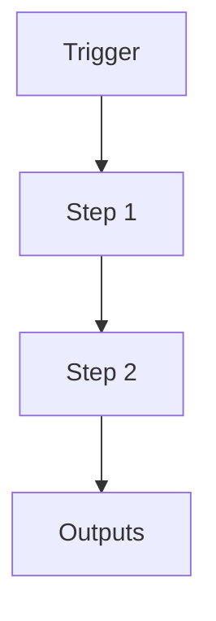

# [CAPABILITY_NAME]

```yaml
# Zone 2: Capability metadata (machine-readable)
capability_id: [slug-id]          # kebab-case unique ID, e.g. "meeting-pipeline-v3"
name: "[Human-readable name]"
category: [integration|internal|orchestrator|agent|site|workflow]
status: [active|experimental|deprecated]
confidence: [high|medium|low]
last_verified: [YYYY-MM-DD]
tags:
  - [primary-domain]
  - [optional-secondary]
entry_points:
  - type: prompt
    id: "Prompts/...[.prompt.md]"
  - type: script
    id: "N5/scripts/....py"
  - type: url
    value: "https://..."
  - type: agent
    id: "[scheduled-task-id-or-name]"
owner: "V"
```

## What This Does

Brief overview (2–5 sentences) of what this capability does and why it exists.

## How to Use It

- How to trigger it (prompts, commands, UI entry points)
- Typical usage patterns and workflows

### Entry point types

- **prompt** – Points to a `.prompt.md` file that a persona can load or that can be referenced via `@prompt` syntax.
- **script** – Points to a Python (or other) script that executes the core logic for this capability.
- **url** – External web UI or API endpoint relevant to this capability.
- **agent** – Refers to a scheduled task or background worker that implements this capability.

## Associated Files & Assets

List key implementation and configuration files using `file '...'` syntax where helpful.

- `file 'relative/path/from/workspace.md'` – description
- `file 'N5/scripts/example.py'` – description

## Workflow

Describe the execution flow. Optionally include a mermaid diagram.



## Notes / Gotchas

- Edge cases
- Preconditions
- Safety considerations
- Migration notes / compatibility notes if relevant

### Example: Simple internal workflow capability

```yaml
capability_id: meeting-notes-condenser
name: "Meeting notes condenser"
category: internal
status: experimental
confidence: medium
last_verified: 2025-11-29
tags:
  - meetings
  - summarization
entry_points:
  - type: prompt
    id: "Prompts/meetings/meeting_notes_condenser.prompt.md"
owner: "V"
```


