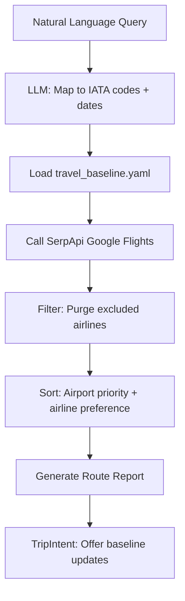

# Google Flights

```yaml
# Zone 2: Capability metadata (machine-readable)
capability_id: google-flights
name: Google Flights Travel Intelligence
category: integration
status: active
confidence: high
last_verified: '2026-01-09'
tags: [travel, flights, serpapi, search]
owner: V
purpose: |
  Python-based travel intelligence engine that performs natural language flight searches 
  filtered by V's baseline preferences (airport priority, airline preferences, exclusions), 
  returning structured "Route Reports" with historical price analysis.
components:
  - Integrations/google_flights.py
  - Knowledge/reference/travel_baseline.yaml
  - N5/templates/travel/route_report.md
  - Prompts/Flight Search.prompt.md
operational_behavior: |
  Accepts natural language queries ("NYC to London March 1-7"), maps to IATA codes,
  calls SerpApi Google Flights, filters/sorts by V's preferences, outputs Route Report.
interfaces:
  - prompt: Prompts/Flight Search.prompt.md
  - script: python3 Integrations/google_flights.py --query "..."
quality_metrics: |
  - Correct IATA mapping for airports
  - Spirit/Frontier purged from results
  - LGA > JFK > EWR priority maintained
  - Route Report format generated
```

## What This Does

A personalized flight search engine built on SerpApi that understands V's travel preferences. Instead of generic flight results, it applies deterministic filters (preferred airports, airlines, cabin class) and returns a structured "Route Report" with price context (typical/low/high ranges). The system learns over time via the TripIntent protocol, prompting V to update baselines after each search.

## How to Use It

**Via Prompt:**
```
@Flight Search NYC to LAX next weekend
```

**Via Script:**
```bash
python3 Integrations/google_flights.py --query "NYC to London March 1-7"
```

## Associated Files & Assets

- `file 'Integrations/google_flights.py'` — Core SerpApi client with filtering logic
- `file 'Knowledge/reference/travel_baseline.yaml'` — V's preferences (airports, airlines, exclusions)
- `file 'N5/templates/travel/route_report.md'` — Structured output template
- `file 'Prompts/Flight Search.prompt.md'` — Natural language interface

## Workflow



## Notes / Gotchas

- **API Key:** Uses `SERPAPI_PRIVATE_KEY` from environment
- **Airport Priority:** LGA > JFK > EWR (descending preference)
- **Excluded Airlines:** Spirit, Frontier (always purged)
- **Preferred Airlines:** JetBlue, Delta
- **Cabin:** Economy with `exclude_basic: true`
- **Caching:** Results cached 24h in conversation workspace to conserve API credits
- **Future:** Price monitoring agent (P5) and historical analysis (P6) planned but not yet implemented

## Build History

- `file 'N5/builds/google-flights/'` — Original build (Phases 1-4 complete)

