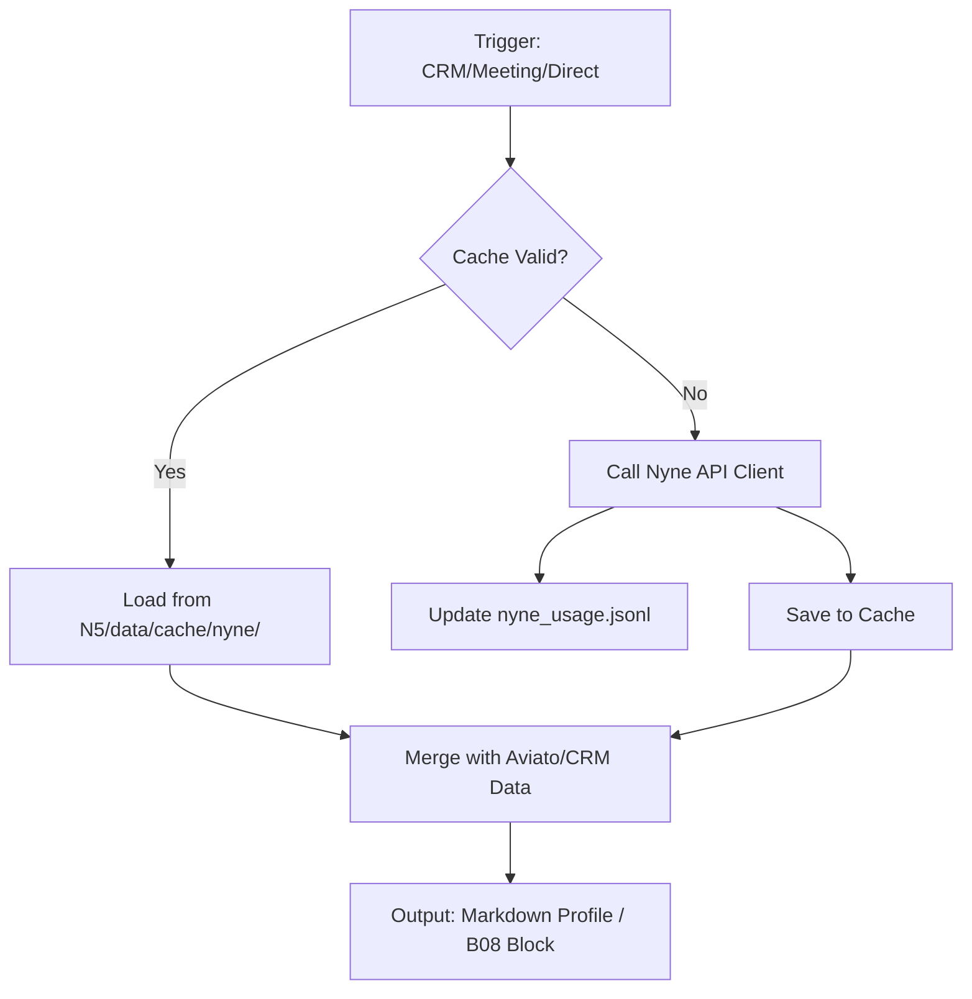

# Nyne Integration

```yaml
# Zone 2: Capability metadata (machine-readable)
capability_id: nyne-integration
name: Nyne Integration
category: integration
status: active
confidence: high
last_verified: '2026-01-09'
tags: [enrichment, crm, intelligence, social-data]
owner: V
purpose: |
  Provides high-fidelity person and company enrichment by integrating the Nyne API as a primary source for social signals, newsfeeds, and interests, serving as a selective fallback to Aviato.
components:
  - Integrations/Nyne/nyne_client.py
  - N5/scripts/enrichment/nyne_enricher.py
  - N5/scripts/enrichment/org_enricher.py
  - N5/logs/nyne_usage.jsonl
  - N5/data/cache/nyne/
  - Personal/Knowledge/CRM/organizations/
operational_behavior: |
  Operates on a "D + Selective + Fallback" strategy. It triggers during CRM profile creation or updates, meeting preparation workflows, and organization enrichment. The system utilizes 7-day caching for social newsfeed data and logs all credit usage to a centralized JSONL file.
interfaces:
  - prompt: "@Nyne" (Prompts/Nyne.prompt.md)
  - prompt: "@CRM Profile Enrichment" (N5/workflows/crm_enrich_profile.prompt.md)
  - prompt: "@CRM Org Enrichment" (N5/workflows/org_enrich_profile.prompt.md)
  - script: python3 N5/scripts/enrichment/nyne_enricher.py
  - script: python3 Integrations/Nyne/test_suite.py
quality_metrics: |
  - 100% success rate on core client API calls (person, company, newsfeed).
  - Accurate credit tracking in nyne_usage.jsonl.
  - Successful merge of Nyne social data into Aviato-based CRM profiles.
  - Successful generation of B08 Stakeholder Intelligence blocks with Nyne interests.
```

## What This Does

Nyne Integration is a core intelligence layer within N5 that bridges the gap between static professional data and active social presence. It fetches real-time newsfeeds, personal interests, and company-specific signals (like sales intelligence via CheckSeller) to enrich both individual CRM profiles and organization records. By acting as a specialized fallback to Aviato, it ensures that stakeholder intelligence is always multi-dimensional, particularly regarding a contact's recent social activity and thematic interests.

## How to Use It

This capability is primarily handled by the system during automated workflows, but can be triggered manually:

- **Manual Enrichment:** Use `@Nyne` to research a specific person or company directly.
- **CRM Workflows:** Trigger `@CRM Profile Enrichment` or `@CRM Org Enrichment`. The system will automatically invoke the Nyne modules if social data is sparse.
- **Meeting Prep:** When generating meeting intelligence, the system automatically calls `get_recent_social_activity` to populate the "Social Presence" sections of your digest and B08 blocks.
- **Testing:** Run the test suite via `python3 Integrations/Nyne/test_suite.py --quick` to verify API connectivity and credit balance.

## Associated Files & Assets

- Core Client: file 'Integrations/Nyne/nyne_client.py'
- Person Enricher: file 'N5/scripts/enrichment/nyne_enricher.py'
- Org Enricher: file 'N5/scripts/enrichment/org_enricher.py'
- User Prompt: file 'Prompts/Nyne.prompt.md'
- Usage Logs: file 'N5/logs/nyne_usage.jsonl'
- Cache Directory: file 'N5/data/cache/nyne/'

## Workflow

The integration follows a tiered execution flow depending on the data source availability and the specific request type.



## Notes / Gotchas

- **Credit Sensitivity:** Nyne uses a credit-based system. Always use `--dry-run` or check the usage logs if performing bulk operations.
- **LinkedIn Requirement:** Company enrichment via Nyne requires a valid `social_media_url` (specifically the LinkedIn company URL) to function reliably.
- **Caching:** Social newsfeeds are cached for 7 days to conserve credits. If you need a forced refresh, you must clear the relevant file in `N5/data/cache/nyne/`.
- **API Keys:** Ensure `NYNE_API_KEY` and `NYNE_API_SECRET` are correctly set in your environment secrets.
- **Parameter Names:** When using advanced modules like CheckSeller, ensure parameters match the Nyne spec exactly (fixed in Phase 6).

[2026-01-09 03:40:00 ET]