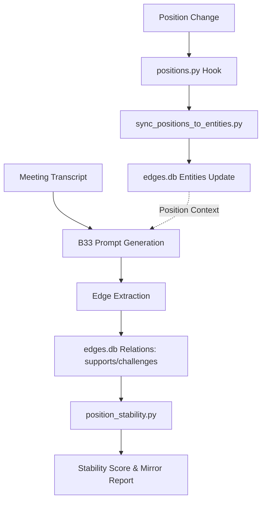

# Position Integration

```yaml
# Zone 2: Capability metadata (machine-readable)
capability_id: position-integration
name: Position Integration
category: integration
status: active
confidence: high
last_verified: '2026-01-09'
tags: [positions, context-graph, cognitive-mirror, sync]
owner: V
purpose: |
  Integrates V's worldview positions into the Context Graph (edges.db) to enable bidirectional evidence tracking and automated stability analysis.
components:
  - file 'N5/scripts/sync_positions_to_entities.py'
  - file 'N5/scripts/cognitive_mirror/position_stability.py'
  - file 'N5/scripts/edge_types.py'
  - file 'N5/scripts/generate_b33_edges.py'
  - file 'N5/prompts/Blocks/Generate_B33.prompt.md'
operational_behavior: |
  Automatically syncs positions to the entities table in the Context Graph via database hooks. Enhances meeting intelligence (B33) to detect evidence that supports or challenges established positions.
interfaces:
  - python3 N5/scripts/sync_positions_to_entities.py [--dry-run]
  - python3 N5/scripts/cognitive_mirror/position_stability.py
  - "@Generate_B33"
quality_metrics: |
  100% parity between positions.db and entities table; successful detection of 'supports_position' relations in B33 blocks.
```

## What This Does

This capability bridges V’s structured belief system (Positions) with the dynamic evidence captured in the Context Graph. By registering positions as entities and introducing specific relation types like `crystallized_from` and `supports_position`, the system can now trace the evolution of a position back to specific meeting evidence. It allows for "Cognitive Mirror" analysis, where the AI can audit how stable or challenged a position is based on the flow of new information.

## How to Use It

- **Automated Sync:** The capability is primarily "invisible." When you add, update, or delete a position via `positions.py`, the `sync_position_to_entities()` hook automatically updates the Context Graph.
- **Manual Sync:** To force a full reconciliation between databases, run `python3 N5/scripts/sync_positions_to_entities.py`.
- **Edge Extraction:** During meeting processing, use the updated `@Generate_B33` prompt. The system will inject position context to help identify when a discussion supports or challenges a known position.
- **Stability Analysis:** Run `python3 N5/scripts/cognitive_mirror/position_stability.py` to generate a report on how recent meeting edges have influenced position confidence scores.

## Associated Files & Assets

- file 'N5/scripts/sync_positions_to_entities.py' — The primary bridge between `positions.db` and `edges.db`.
- file 'N5/scripts/cognitive_mirror/position_stability.py' — Analysis engine for position-edge support.
- file 'N5/scripts/edge_types.py' — Defines `crystallized_from`, `supports_position`, and `challenges_position` relations.
- file 'N5/scripts/generate_b33_edges.py' — Logic for injecting position context into meeting intelligence prompts.
- file 'N5/data/edges.db' — The canonical Context Graph storage.

## Workflow



## Notes / Gotchas

- **Hook Dependency:** Ensure `positions.py` is used for all position mutations; direct SQLite edits to `positions.db` will bypass the auto-sync hooks.
- **Metadata Snippets:** The sync process truncates long position insights to a 200-character preview in the entity metadata to keep the Context Graph performant.
- **Schema Safety:** While no schema changes were required for `edges.db` (as the entities table is polymorphic), ensure that `ENTITY_TYPES` in the application logic includes 'position' to prevent lookup errors.

2026-01-09 03:40:00 ET