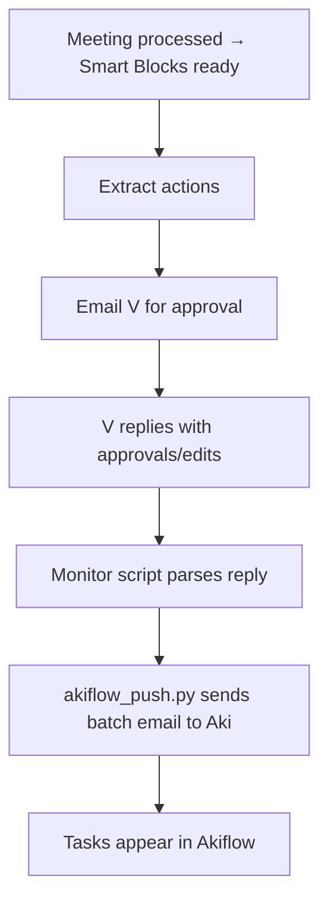

# Akiflow Actions Bridge (Aki)

```yaml
capability_id: akiflow-actions-bridge
name: "Akiflow Actions Bridge (Aki)"
category: integration
status: experimental
confidence: medium
last_verified: 2025-11-29
tags:
  - tasks
  - meetings
  - productivity
entry_points:
  - type: script
    id: "N5/scripts/extract_meeting_actions.py"
  - type: script
    id: "N5/scripts/monitor_action_approvals.py"
  - type: script
    id: "N5/scripts/akiflow_push.py"
owner: "V"
```

## What This Does

Bridges meeting-derived action items from N5 into Akiflow via Aki's email interface. It extracts tasks from processed meeting Smart Blocks, routes them to email for human approval, and then batch-creates Akiflow tasks once approved.

## How to Use It

- Ensure the meeting processing system is generating Smart Blocks (B01, B25, etc.) for completed meetings.
- Run `extract_meeting_actions.py` after meeting processing to create structured action JSON files under `N5/inbox/meeting_actions/`.
- Use `monitor_action_approvals.py` to watch for email replies approving or editing actions, then trigger `akiflow_push.py` to send a formatted email to Aki.
- Follow the workflow in `meeting-to-akiflow.md` for end-to-end behavior from meeting completion to tasks appearing in Akiflow.

## Associated Files & Assets

- `file 'N5/workflows/meeting-to-akiflow.md'` – High-level workflow design
- `file 'N5/scripts/extract_meeting_actions.py'` – Extracts structured actions from Smart Blocks
- `file 'N5/scripts/monitor_action_approvals.py'` – Monitors Gmail for approval replies
- `file 'N5/scripts/akiflow_push.py'` – Formats and sends actions to Akiflow via Aki

## Workflow



## Notes / Gotchas

- Relies on Gmail integration and Aki's email interface; ensure email addresses and routing are configured correctly.
- Human-in-the-loop approval is a core design element; do not auto-push without explicit confirmation from V.
- Meeting naming and Smart Block consistency are important for reliable extraction.


