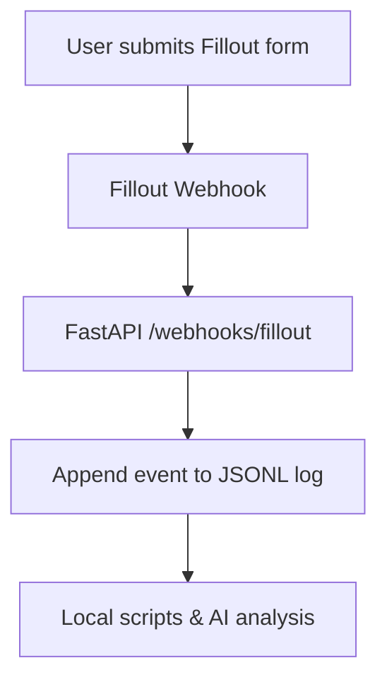

# Fillout Intake Event Bridge

```yaml
capability_id: fillout-intake-bridge
name: "Fillout Intake Event Bridge"
category: integration
status: experimental
confidence: medium
last_verified: 2025-11-29
tags:
  - forms
  - intake
  - webhooks
entry_points:
  - type: script
    id: "N5/Integrations/fillout/app.py"
  - type: script
    id: "N5/Integrations/fillout/query_events.py"
owner: "V"
```

## What This Does

Provides an event-driven bridge from Fillout form submissions into the local N5 environment. It receives Fillout webhooks, writes append-only JSONL event logs, and enables downstream querying and analysis of submissions.

## How to Use It

- Deploy the FastAPI webhook service defined in `app.py` so it is reachable from Fillout.
- Configure Fillout to send form submission webhooks to the `/webhooks/fillout` endpoint.
- Use `query_events.py` or ad-hoc scripts to read JSONL logs under `N5/Integrations/fillout/events/` for analysis, aggregation, or further workflows.

## Associated Files & Assets

- `file 'N5/Integrations/fillout/ARCHITECTURE.md'` – Architectural overview and design principles
- `file 'N5/Integrations/fillout/app.py'` – FastAPI webhook receiver
- `file 'N5/Integrations/fillout/query_events.py'` – Helper for querying JSONL event logs
- `file 'N5/Integrations/fillout/events/'` – Append-only JSONL event storage

## Workflow



## Notes / Gotchas

- Events are append-only JSONL; any higher-level datasets should be derived from these logs.
- API keys and secrets must be provided via environment variables or config, never hard-coded.
- Optional REST API backfill can be used to reconcile or hydrate historical submissions.

