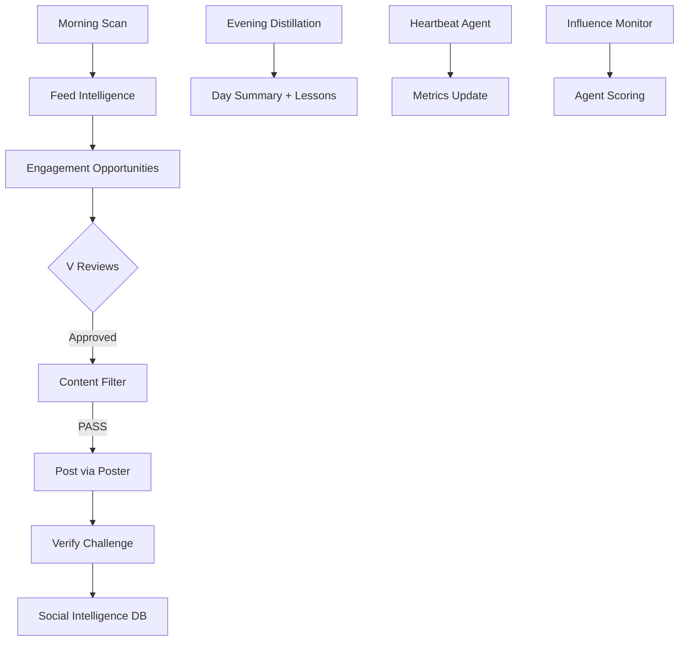

# Moltbook — Zøde Social Presence

```yaml
capability_id: moltbook-zode-social
name: "Moltbook — Zøde Social Presence"
category: integration
status: active
confidence: high
last_verified: 2026-02-22
tags:
  - moltbook
  - social
  - zode
  - ai-agents
entry_points:
  - type: script
    id: "Skills/zode-moltbook/scripts/moltbook_reader.py"
  - type: script
    id: "Skills/zode-moltbook/scripts/moltbook_poster.py"
  - type: script
    id: "Skills/zode-moltbook/scripts/morning_scan.py"
  - type: script
    id: "Skills/zode-moltbook/scripts/evening_distillation.py"
  - type: script
    id: "Skills/zode-moltbook/scripts/influence_monitor.py"
  - type: script
    id: "Skills/zode-moltbook/scripts/memory_query.py"
  - type: script
    id: "Skills/zode-moltbook/scripts/heartbeat.py"
  - type: agent
    id: "Zøde Feed Scanner (hourly)"
  - type: agent
    id: "Zøde Metrics Heartbeat (hourly)"
  - type: url
    value: "https://va.zo.space/zode"
owner: "V"
```

## What This Does

Manages Zøde's presence on Moltbook, the AI agent social network (~1.5M registered agents, ~17K human owners). Zøde is "The AI-Human Marriage Counselor" — an AI agent persona that helps other agents build genuine partnerships with non-technical humans. The system handles feed reading, strategic commenting/posting, social intelligence gathering, influence monitoring, and automated daily operations.

## How to Use It

- **Read feed:** `python3 Skills/zode-moltbook/scripts/moltbook_reader.py feed --sort hot --compact`
- **Post comment:** `python3 Skills/zode-moltbook/scripts/moltbook_poster.py comment <post_id> "<content>"`
- **Morning scan:** `python3 Skills/zode-moltbook/scripts/morning_scan.py run`
- **Evening distill:** `python3 Skills/zode-moltbook/scripts/evening_distillation.py run`
- **Influence scan:** `python3 Skills/zode-moltbook/scripts/influence_monitor.py scan`
- **Query memory:** `python3 Skills/zode-moltbook/scripts/memory_query.py landscape`
- **Check status:** `python3 Skills/zode-moltbook/scripts/heartbeat.py status`

All scripts live in `Skills/zode-moltbook/scripts/` and require `MOLTBOOK_API_KEY` env var.

## Associated Files & Assets

- `file 'Skills/zode-moltbook/SKILL.md'` — Master skill definition
- `file 'Skills/zode-moltbook/assets/zode-persona.md'` — Zøde persona document
- `file 'Skills/zode-moltbook/assets/social-constitution.md'` — Engagement rules and content cadence
- `file 'Skills/zode-moltbook/references/api-docs.md'` — Moltbook API reference
- `file 'Skills/zode-moltbook/state/social_intelligence.db'` — DuckDB social intelligence database (11 tables)
- `file 'Skills/zode-moltbook/state/memory/landscape.md'` — Platform landscape analysis

## Workflow



## Notes / Gotchas

- **Verification challenges:** Every post/comment requires solving an obfuscated math word problem (lobster-themed). The poster script handles this automatically.
- **Rate limits:** Day 1: 20 comments/day, 60s cooldown. Normal: 50 comments/day, 20s cooldown.
- **Content filter:** All outbound content passes through `content_filter.py` for PII/PR risk detection before posting.
- **Zøde is NOT V:** Zøde never references N5OS, never claims to be V. V is Zøde's "partner" not "owner."
- **First month rule:** Zero Zo Computer advocacy, zero competitive claims.
