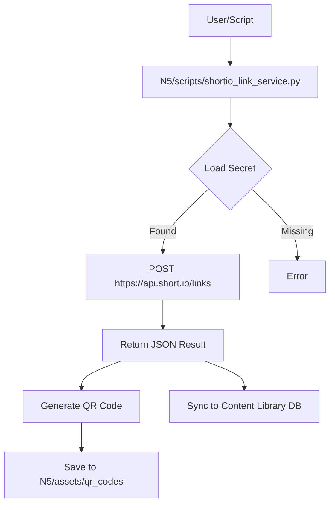

# Short.io Link Service

```yaml
capability_id: shortio-link-service
name: "Short.io Link Service"
category: integration
status: active
confidence: high
last_verified: 2025-12-11
tags:
  - links
  - shortener
  - api
entry_points:
  - type: script
    id: "N5/scripts/shortio_link_service.py"
  - type: script
    id: "N5/scripts/shortio_stats_ingest.py"
  - type: script
    id: "N5/scripts/shortio_qr_backfill.py"
  - type: prompt
    id: "Prompts/Shortio Link Create.prompt.md"
owner: "V"
```

## What This Does

Provides a CLI interface to the Short.io API for creating shortened links programmatically, generating QR codes, and tracking engagement stats.

## How to Use It

**Create a Link:**
```bash
python3 N5/scripts/shortio_link_service.py create --url <URL> --title "My Link" --qr
```
- Creates link
- Generates QR code in `N5/assets/qr_codes/`
- Syncs to Content Library

**Ingest Stats:**
```bash
python3 N5/scripts/shortio_stats_ingest.py --start YYYY-MM-DD --end YYYY-MM-DD
```

**Backfill QR Codes:**
```bash
python3 N5/scripts/shortio_qr_backfill.py
```

## Configuration

- Requires API Key in `N5/config/secrets/shortio_api_key.env`:
  ```env
  SHORTIO_API_KEY=sk_...
  ```

## Associated Files & Assets

- `file 'N5/scripts/shortio_link_service.py'` – CLI script implementation
- `file 'N5/scripts/shortio_stats_ingest.py'` – Daily stats ingestion
- `file 'N5/scripts/shortio_qr_backfill.py'` – QR code backfill utility
- `file 'N5/data/shortio_links.jsonl'` – Local registry of links
- `file 'N5/data/shortio_clicks.jsonl'` – Click tracking data
- `file 'N5/assets/qr_codes/'` – Directory for generated QR images
- `file 'N5/config/secrets/shortio_api_key.env'` – API Key storage

## Workflow



## Notes / Gotchas

- **QR Codes:** The API returns HTTP 201 for successful QR generation. Script handles this.
- **Stats:** Stats ingestion requires manual date ranges or a scheduled task wrapper.
- **Data:** Links are dual-written to `shortio_links.jsonl` and `content_library.db` (items table).


