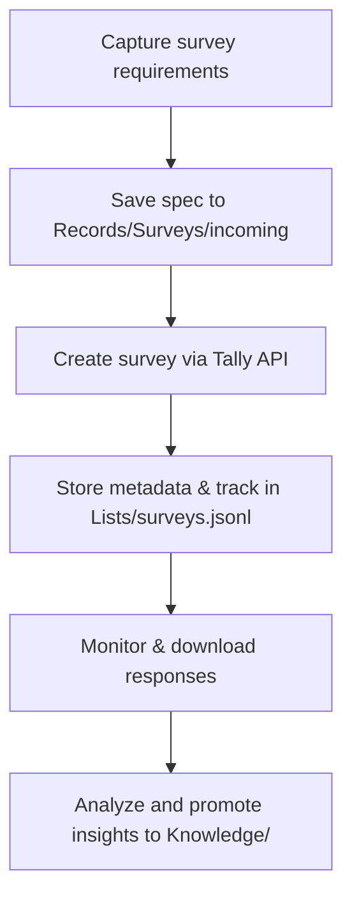

# Tally Survey Integration

```yaml
capability_id: tally-survey-integration
name: "Tally Survey Integration"
category: integration
status: active
confidence: medium
last_verified: 2025-11-29
tags:
  - surveys
  - research
  - feedback
entry_points:
  - type: script
    id: "N5/scripts/tally_manager.py"
  - type: prompt
    id: "Prompts/integrations/tally-create-survey.prompt.md"
owner: "V"
```

## What This Does

Integrates the Tally.so survey platform with N5, allowing creation, listing, and retrieval of surveys and responses via API, following the Records layer pattern for storage and analysis.

## How to Use It

- Invoke natural-language flows (e.g., "Create a feedback survey with name, email, rating, and comments") or use slash commands like `/Create Tally Survey`.
- Use the `tally_manager.py` script and related commands (`tally-list`, `tally-create`, `tally-get`, `tally-submissions`, `tally-user`) to manage forms and download responses.
- Store specifications, drafts, published metadata, responses, and exports under the Records/Surveys directories as defined in the integration prefs.

## Associated Files & Assets

- `file 'N5/prefs/integration/tally.md'` – Integration preferences and workflow
- `file 'N5/schemas/tally.survey.schema.json'` – Tally metadata schema
- `file 'N5/scripts/tally_manager.py'` – Core script for Tally API operations
- `file 'Records/Surveys/README.md'` – Storage layout for survey specs, drafts, responses, and exports

## Workflow



## Notes / Gotchas

- API key must be stored in `N5/config/tally_api_key.env` and never committed.
- Response data may contain PII; follow Records and Knowledge patterns for safe handling.
- Tally free plan has branding and a 7-day analytics window; rely on local exports for long-term analysis.

