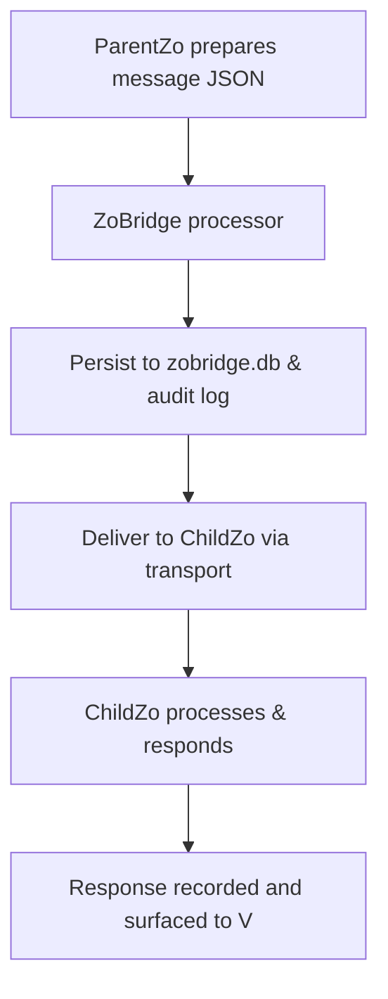

# ZoBridge Parent-Child Link

```yaml
capability_id: zobridge-parent-child-link
name: "ZoBridge Parent-Child Link"
category: integration
status: experimental
confidence: medium
last_verified: 2025-11-29
tags:
  - ai-to-ai
  - orchestration
  - bridge
entry_points:
  - type: script
    id: "N5/services/zobridge/server.ts"
  - type: script
    id: "N5/services/zobridge/zobridge_processor.py"
owner: "V"
```

## What This Does

Defines and implements the ZoBridge protocol for collaboration between a ParentZo (production) system and a ChildZo (demonstrator) system. It coordinates message passing, state tracking, and audit logging for AI-to-AI bootstrap and synchronization work.

## How to Use It

- Use the ZoBridge service and processor to send JSON-based messages (questions, instructions, proposals) from ParentZo to ChildZo and receive responses.
- Follow the protocol described in the ZoBridge README for message types, safety mechanisms, and V's oversight role.
- Use the audit and database files to inspect conversation history, checkpoints, and system state.

## Associated Files & Assets

- `file 'N5/services/zobridge/README.md'` – Protocol overview and bootstrap strategy
- `file 'N5/services/zobridge/zobridge.config.json'` – Service configuration
- `file 'N5/services/zobridge/zobridge_processor.py'` – Message processing logic
- `file 'N5/services/zobridge/zobridge.db'` – SQLite state store
- `file 'N5/services/zobridge/zobridge_audit.jsonl'` – JSONL audit log of bridge messages

## Workflow



## Notes / Gotchas

- Current transport is file-based JSON exchange mediated by V; HTTP endpoints are a future phase.
- Protocol enforces safety via rate limits, checkpoints, and V override; destructive operations should always be dry-run first.
- Bridge is intended for AI-to-AI collaboration and should not expose Careerspan data in ChildZo.


