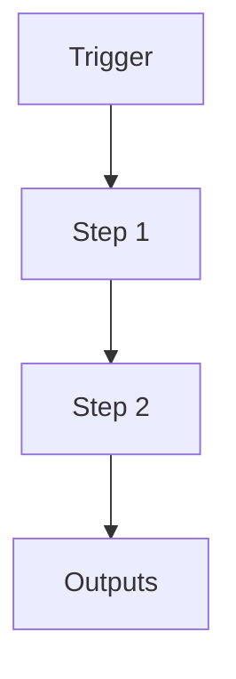

# ANN-Indexed Semantic Search

```yaml
# Zone 2: Capability metadata (machine-readable)
capability_id: ann-indexed-semantic-search
name: ANN-Indexed Semantic Search
category: internal
status: active
confidence: medium
last_verified: '2025-12-16'
tags: []
owner: V
purpose: Provides a canonical, high-performance semantic search layer using HNSW indexing
  for the N5 operating system.
components:
- N5/cognition/brain.db
- N5/cognition/n5_memory_client.py
- N5/scripts/n5_rebuild_ann_index.py
- N5/scripts/migrate_positions_to_brain.py
- N5/cognition/brain.hnsw
operational_behavior: Ingests text blocks into brain.db, generates embeddings via
  OpenAI, builds HNSW index for fast retrieval, and supports profile-based search.
interfaces:
- N5MemoryClient.search()
- N5MemoryClient.get_embedding()
- CLI scripts for reindexing
quality_metrics: Index consistency with DB, search latency <200ms
```

## What This Does

Brief overview (2–5 sentences) of what this capability does and why it exists.

## How to Use It

- How to trigger it (prompts, commands, UI entry points)
- Typical usage patterns and workflows

## Associated Files & Assets

List key implementation and configuration files using `file '...'` syntax where helpful.

## Workflow

Describe the execution flow. Optionally include a mermaid diagram.



## Notes / Gotchas

- Edge cases
- Preconditions
- Safety considerations
