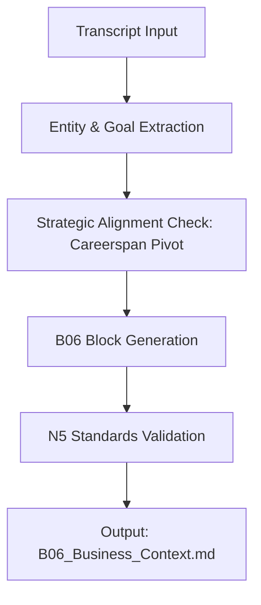

# B06 Generation Careerspan

```yaml
# Zone 2: Capability metadata (machine-readable)
capability_id: b06-generation-careerspan
name: B06 Generation Careerspan
category: internal
status: active
confidence: high
last_verified: '2026-01-09'
tags: [intelligence, careerspan, business-context, n5-blocks]
owner: V
purpose: |
  Automates the generation of B06 Business Context blocks for Careerspan meetings, ensuring strategic alignment with the shift toward candidate-side technology and mid-career/Gen Z experiments.
components:
  - N5/builds/b06-generation-careerspan/PLAN.md
  - N5/builds/b06-generation-careerspan/STATUS.md
  - /home/workspace/Prompts/Blocks/Generate_B06.prompt.md
operational_behavior: |
  The capability analyzes meeting transcripts to extract strategic business goals and challenges, mapping them to the Careerspan ecosystem (hiring, mobility, candidate tech) while enforcing strict naming conventions and schema validation.
interfaces:
  - prompt: "@Generate_B06"
  - workflow: "meeting-process"
quality_metrics: |
  Success is defined by the correct spelling of "Careerspan", accurate mapping of candidate-side strategic shifts, and inclusion of mid-career/Gen Z cohort experimental data.
```

## What This Does

This capability provides an automated engine for generating the "B06 Business Context" block, a core component of the N5 meeting intelligence system. It specifically tailors the extraction logic to Careerspan's unique business domain, focusing on the strategic pivot from employer-side sourcing to candidate-side career technology. By analyzing transcripts, it identifies goals, challenges, and shifts in internal mobility and hiring workflows, ensuring that every meeting record is grounded in the broader Careerspan strategic roadmap.

## How to Use It

This capability is typically invoked as part of the broader meeting processing workflow or as a standalone extraction:

- **Prompts:** Use file '/home/workspace/Prompts/Blocks/Generate_B06.prompt.md' by mentioning it in a conversation with a meeting transcript or folder context.
- **Commands:** It is triggered internally during the `meeting-process` command when the B06 block is selected for generation.
- **UI:** Visible in the [Discover](/discover) section under N5 Blocks or through the prompt invocation menu.

## Associated Files & Assets

- file 'N5/builds/b06-generation-careerspan/PLAN.md' — The original build specification.
- file 'N5/builds/b06-generation-careerspan/STATUS.md' — Implementation tracking and graduation record.
- file 'Prompts/Blocks/Generate_B06.prompt.md' — The primary prompt interface for generating the block.

## Workflow

The execution flow involves scanning the raw transcript for semantic markers related to business operations, followed by a mapping phase that aligns these markers with Careerspan's current strategic priorities.



## Notes / Gotchas

- **Naming Convention:** Ensure "Careerspan" is always used; do not use "CareerSpan" (camel case).
- **Domain Specificity:** The extractor is biased toward finding mid-career and Gen Z cohort mentions as these are high-priority experiments.
- **Preconditions:** Requires a valid meeting transcript or manifest in [M] state to provide sufficient context for business mapping.

01/09/2026 03:41:04 ET