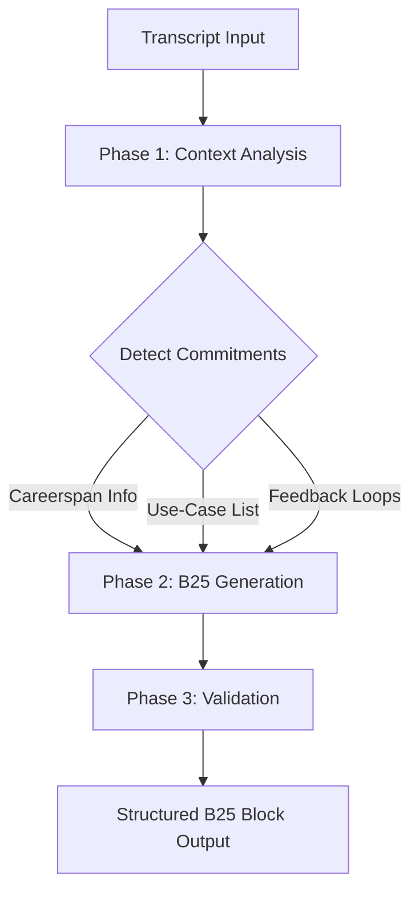

# B25 Deliverable Map Careerspan

```yaml
# Zone 2: Capability metadata (machine-readable)
capability_id: b25-deliverable-map-careerspan
name: B25 Deliverable Map Careerspan
category: internal
status: active
confidence: high
last_verified: '2026-01-09'
tags: [meeting-intelligence, deliverable-tracking, careerspan]
owner: V
purpose: |
  Automatically extracts and maps promised or implied deliverables from meeting transcripts into a structured B25 Deliverable Content Map.
components:
  - N5/builds/b25-deliverable-map-careerspan/PLAN.md
  - N5/builds/b25-deliverable-map-careerspan/STATUS.md
  - N5/builds/b25-deliverable-map-careerspan/B25_Deliverable_Content_Map.md
operational_behavior: |
  Scans meeting transcripts for specific commitments (e.g., info packs, use-case lists), validates them against N5 standards, and generates a structured markdown block for tracking.
interfaces:
  - prompt: Meeting Intelligence Generator
  - prompt: Generate Deliverables
quality_metrics: |
  100% detection of 'Careerspan Info' and 'Zo Use-Case List' items; adherence to 'Careerspan' casing; valid YAML frontmatter in all outputs.
```

## What This Does

This capability automates the generation of the **B25 Deliverable Content Map**, a core intelligence block in the N5 meeting system. It performs deep context analysis on meeting transcripts to identify every commitment made by stakeholders—specifically focusing on deliverables like the "Careerspan Info" pack and the "Zo Use-Case List." By transforming conversational promises into a structured tracking map, it ensures that follow-up actions are never lost and that Careerspan-specific assets are properly categorized.

## How to Use It

This capability is typically triggered as part of the standard meeting processing workflow. You can invoke it manually or via automated agents using the following interfaces:

- **Prompts**: Call `file 'Prompts/Meeting Intelligence Generator.prompt.md'` or `file 'Prompts/Generate Deliverables.prompt.md'` targeting a specific meeting folder in `Personal/Meetings/Inbox/`.
- **UI Entry Points**: Trigger the "Generate Deliverables" action from the Meeting detail view in the Zo app.
- **Automated Flow**: It runs automatically during the transition from `[M]` (Manifest) to `[P]` (Processed) state for meeting folders.

## Associated Files & Assets

- `file 'N5/builds/b25-deliverable-map-careerspan/PLAN.md'` - The implementation roadmap.
- `file 'N5/builds/b25-deliverable-map-careerspan/STATUS.md'` - Execution progress and graduation record.
- `file 'N5/builds/b25-deliverable-map-careerspan/B25_Deliverable_Content_Map.md'` - The canonical output template for Careerspan deliverables.

## Workflow

The execution flow follows a three-phase implementation logic to ensure high-fidelity mapping of commitments.



## Notes / Gotchas

- **Casing Enforcement**: The system strictly enforces the "Careerspan" spelling (never "CareerSpan").
- **State Dependencies**: This capability requires a valid meeting manifest (`manifest.json`) and a clean transcript to be present in the target meeting folder.
- **Safety**: Does not delete or move source transcripts; it only creates or updates the `B25_Deliverable_Content_Map.md` file within the meeting's directory.
- **Edge Cases**: If no deliverables are detected, the system will generate an empty B25 block with a "No explicit deliverables detected" status to maintain block consistency.

01-09-2026 03:42:15 ET