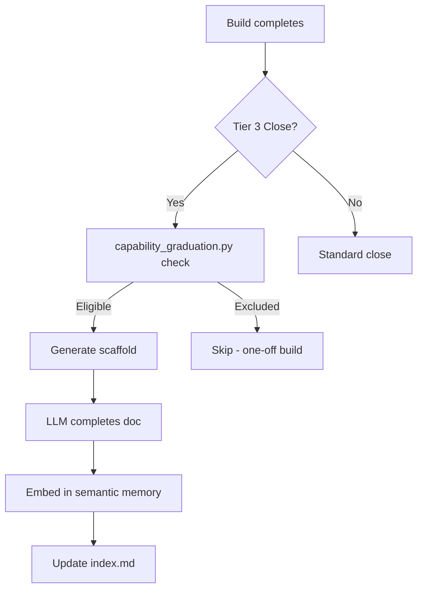

# Capability Graduation System

```yaml
capability_id: capability-graduation-system
name: Capability Graduation System
category: internal
status: active
confidence: high
last_verified: '2026-01-09'
tags: [builds, capabilities, semantic-memory, conversation-close]
owner: V
purpose: |
  Graduates completed builds from N5/builds/ into the capability registry (N5/capabilities/)
  and embeds them in semantic memory for discoverability. Integrates with Tier 3 conversation close.
components:
  - N5/scripts/capability_graduation.py
  - N5/capabilities/index.md
  - N5/cognition/brain.db (semantic memory)
operational_behavior: |
  1. Detects completed builds (100% progress in STATUS.md)
  2. Filters out one-off builds (meeting-specific, mg2-*, con_*)
  3. Infers category (internal/integration/workflow/prompt/site)
  4. Generates capability doc scaffold with LLM completion points
  5. Embeds completed doc in semantic memory via N5MemoryClient
interfaces:
  - CLI: python3 N5/scripts/capability_graduation.py <command>
  - Integration: Called during Tier 3 conversation close (@Close Conversation)
quality_metrics: |
  - Completed builds have capability docs within 24 hours
  - Capability docs are discoverable via semantic search
  - No orphaned builds older than 2 weeks
```

## What This Does

Bridges the gap between **build completion** and **capability documentation**. Previously, builds would complete in `N5/builds/` but never get recorded in the capability registry, making them undiscoverable. This system:

1. Automatically identifies builds eligible for graduation
2. Generates structured capability doc scaffolds
3. Integrates with conversation close so graduation happens naturally
4. Embeds capabilities in semantic memory for RAG retrieval

## How to Use It

### During Conversation Close (automatic)

When closing a Tier 3 (build) conversation, the Librarian runs:

```bash
python3 N5/scripts/capability_graduation.py check --build-slug <slug>
python3 N5/scripts/capability_graduation.py graduate --build-slug <slug> --convo-id <id>
```

Then completes the `[LLM: ...]` sections and embeds.

### Manual Commands

```bash
# List all eligible builds
python3 N5/scripts/capability_graduation.py list-eligible

# Check specific build
python3 N5/scripts/capability_graduation.py check --build-slug nyne-integration

# Graduate a build
python3 N5/scripts/capability_graduation.py graduate --build-slug nyne-integration --convo-id con_xyz

# Embed after LLM completes the doc
python3 N5/scripts/capability_graduation.py embed --capability-path N5/capabilities/integration/nyne-integration.md --update-index
```

## Associated Files & Assets

- `file 'N5/scripts/capability_graduation.py'` — Main script
- `file 'N5/prefs/operations/conversation-end-v3.md'` — Integration point (Tier 3 close)
- `file 'Prompts/Close Conversation.prompt.md'` — User-facing prompt
- `file 'N5/capabilities/index.md'` — Capability registry index
- `file 'N5/cognition/n5_memory_client.py'` — Semantic memory client

## Workflow



## Notes / Gotchas

- **Exclusions**: Builds matching `mg2-*`, `con_*`, `*-meeting-*`, or person-specific patterns are automatically excluded as one-offs
- **Category inference**: Based on slug keywords; can be overridden with `--category` flag
- **Semantic memory**: Uses OpenAI embeddings via N5MemoryClient; requires OPENAI_API_KEY
- **Backfill**: Use `list-eligible` to find historical builds needing graduation

