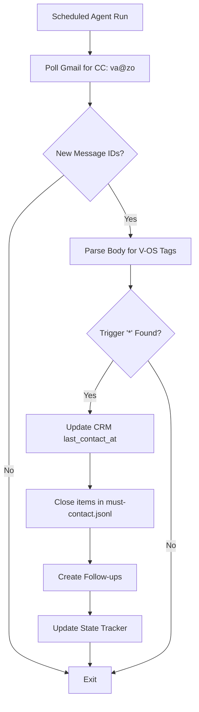

# Cc Outreach Tracker

```yaml
# Zone 2: Capability metadata (machine-readable)
capability_id: cc-outreach-tracker
name: Cc Outreach Tracker
category: internal
status: active
confidence: high
last_verified: '2026-01-09'
tags: [email, crm, automation, v-os]
owner: V
purpose: |
  Automatically process sent emails where V CCs va@zo.computer to update CRM records, 
  close list items, and schedule follow-ups based on embedded V-OS tags.
components:
  - N5/scripts/vos_tag_parser.py
  - N5/scripts/cc_outreach_processor.py
  - N5/config/vos_tags.json
  - N5/docs/vos-tag-system.md
  - N5/data/cc_outreach_state.json
operational_behavior: |
  A scheduled agent polls personal and business Gmail accounts three times daily (9:30 AM, 1:30 PM, 6:30 PM ET) 
  to identify new messages CC'd to Zo. It parses the signature area for white-text V-OS tags, 
  validates the `{Zo}` routing and `*` trigger, then executes logic to update CRM metadata, 
  mark "must-contact" items as done, or create new follow-up tasks.
interfaces:
  - type: agent
    id: cc-outreach-processor
    schedule: "9:30, 13:30, 18:30 ET"
  - type: script
    path: N5/scripts/cc_outreach_processor.py
quality_metrics: |
  - 100% extraction accuracy of tags from triggered `{Zo}` blocks.
  - Successful matching of email recipients to CRM profiles via primary/secondary email addresses.
  - Zero reprocessing of emails via state-tracked message IDs.
```

## What This Does

The CC Outreach Tracker is a "hands-off" CRM maintenance system that allows V to update his personal infrastructure directly from his email workflow. By CC'ing Zo and including specific V-OS tags (like `[CRM]`, `[DONE]`, or `[F-7]`), the system eliminates the need for manual data entry. It serves as the bridge between outbound communication and the N5 intelligence layer, ensuring that "last contact" dates, relationship statuses, and follow-up loops are kept perfectly in sync with real-world activity.

## How to Use It

This capability is primarily **passive**. To trigger it:

1.  **Draft an email** to a contact from `attawar.v@gmail.com` or `vrijen@mycareerspan.com`.
2.  **CC** `va@zo.computer`.
3.  **Embed V-OS Tags** after your signature (usually formatted as white text to remain invisible to the recipient). Ensure the block contains the Zo routing and the asterisk trigger:
    *   Example: `{Zo} [CRM] [F-7] *`
4.  **Wait** for the next scheduled agent run (9:30 AM, 1:30 PM, or 6:30 PM ET).

To run a manual check, you can execute the processor script via terminal:
`python3 N5/scripts/cc_outreach_processor.py`

## Associated Files & Assets

*   file 'N5/scripts/vos_tag_parser.py' — The logic engine for extracting bracketed tags from email bodies.
*   file 'N5/scripts/cc_outreach_processor.py' — The orchestrator that handles Gmail polling and integration logic.
*   file 'N5/config/vos_tags.json' — Canonical definitions for supported tags.
*   file 'N5/docs/vos-tag-system.md' — Full technical documentation of the V-OS tag syntax.

## Workflow

The system follows a linear polling and execution flow:



## Notes / Gotchas

*   **Trigger Required:** Tags will be ignored unless the asterisk `*` is present. This prevents template signatures from triggering accidental updates.
*   **Routing Sensitivity:** The parser specifically looks for `{Zo}`. If only `{Howie}` is present, Zo will ignore the block.
*   **Recipient Matching:** The system matches CRM profiles by email address. If a recipient is not in the CRM, the `[CRM]` tag will fail to update a record but may be logged as a missing contact.
*   **State Management:** The file file 'N5/data/cc_outreach_state.json' prevents duplicate processing. If you need to re-process an email, you must manually remove its ID from that file.

1/9/2026 03:45:00 AM ET