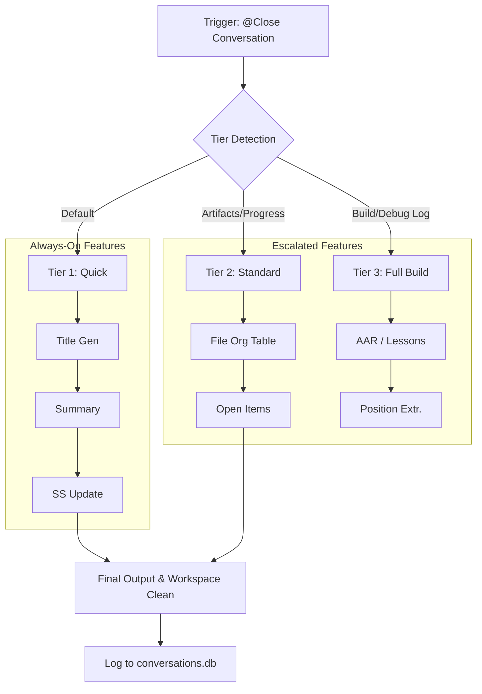

# Conversation End V3

```yaml
# Zone 2: Capability metadata (machine-readable)
capability_id: conversation-end-v3
name: Conversation End V3
category: internal
status: active
confidence: high
last_verified: '2026-01-09'
tags: [workflow, automation, cost-optimization, systems-hygiene]
owner: V
purpose: |
  Standardize the conversation closure process across three intelligent tiers to ensure consistent documentation, 
  automated file organization, and significant cost/token optimization.
components:
  - N5/builds/conversation-end-v3/PLAN.md
  - N5/scripts/conversation_end_v3.py
  - N5/scripts/n5_title_generator.py
  - N5/scripts/conversation_end_analyzer.py
  - Prompts/Close Conversation.prompt.md
operational_behavior: |
  Automated tier detection evaluates conversation markers (SESSION_STATE, file counts, git changes) to execute 
  either a Quick (Tier 1), Standard (Tier 2), or Full Build (Tier 3) closure workflow. It enforces 
  always-on features like title generation and database logging while escalating to complex knowledge 
  capture (AARs, lessons) only when build or troubleshooting signals are detected.
interfaces:
  - prompt: "@Close Conversation" (Auto-detects tier)
  - command: "@Close Conversation --tier=[1|2|3]" (Manual override)
  - script: python3 N5/scripts/conversation_end_v3.py
quality_metrics: |
  - Cost per closure reduced to <$0.05 for non-build sessions.
  - 100% consistent thread titling following N5 naming conventions.
  - Zero 'orphaned' files in conversation workspaces after closure.
  - Accurate extraction of lesson/position candidates in Tier 3 sessions.
```

## What This Does

Conversation End V3 is a tiered closure system designed to replace fragmented and expensive archival workflows with a single, intelligent entry point. It solves the problem of unpredictable documentation by categorizing every interaction into one of three tiers based on complexity: Quick (T1), Standard (T2), or Full Build (T3). By default, it prioritizes speed and cost-efficiency, ensuring every conversation is titled, summarized, and logged to `conversations.db`, while reserving heavyweight analytical tasks—like After-Action Reports (AAR) and lesson extraction—specifically for engineering and build contexts.

## How to Use It

This capability is primarily triggered via the conversational interface at the conclusion of a session.

- **Automatic Usage:** Mention `@Close Conversation` at the end of a thread. The system will scan your current `SESSION_STATE.md`, workspace artifacts, and `DEBUG_LOG.jsonl` to automatically select the appropriate tier.
- **Manual Overrides:**
    - `@Close Conversation --tier=1`: Use for quick Q&A or minor tasks where you want a fast exit.
    - `@Close Conversation --tier=2`: Use for research or strategy discussions that require structured outcome tracking and file mapping.
    - `@Close Conversation --tier=3`: Force a full build closure, including AAR generation and lesson extraction for troubleshooting.
- **Workflow Integration:** The system is also invoked by the `spawn_worker.py` script using the `--mode=archive` flag to handle background cleanup.

## Associated Files & Assets

- `file 'N5/scripts/conversation_end_v3.py'` - The core router and feature flag engine.
- `file 'Prompts/Close Conversation.prompt.md'` - The user-facing interface for closure.
- `file 'N5/scripts/n5_title_generator.py'` - Deterministic naming utility.
- `file 'N5/scripts/conversation_end_analyzer.py'` - Handles semantic file organization and artifact scanning.
- `file 'N5/scripts/session_state_manager.py'` - Updates final status to the state registry.

## Workflow

The execution flow starts with deterministic signal detection to route the session to the correct tier, followed by shared "Always-On" steps and tier-specific "Escalated" steps.



## Notes / Gotchas

- **Tier 3 Prerequisites:** Tier 3 will only auto-activate if `SESSION_STATE.md` has `type: build` or `type: orchestrator`. If you are doing build-like work in a general discussion, use the `--tier=3` flag manually.
- **Cost Sensitivity:** The system is designed to minimize LLM token usage. If a conversation has fewer than 10 messages, summary generation is truncated to save costs.
- **Git Safety:** Tier 2 and 3 closure will run `n5_git_check.py`. If there are uncommitted changes, the system will warn you but will not perform an auto-commit unless specifically authorized.
- **Thread Export:** Note that the legacy `thread_export.py` functionality has been moved to `spawn_worker.py --mode=archive` and is no longer part of the primary closure prompt.

2026-01-09 03:40:00 ET