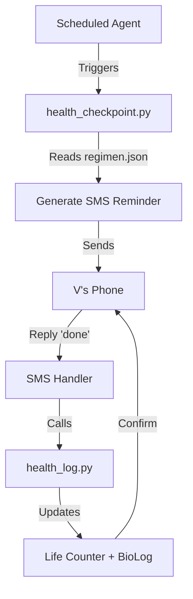

# Health Intelligence Protocol

```yaml
# Zone 2: Capability metadata (machine-readable)
capability_id: health-intelligence-protocol
name: Health Intelligence Protocol
category: internal
status: active
confidence: high
last_verified: '2026-01-09'
tags: [health, automation, life-counter, bio-log, sms-reminders]
owner: V
purpose: |
  Create a generalized, machine-readable health Single Source of Truth (SSOT) that orchestrates automated supplement reminders, Life Counter tracking, and BioLog integration to ensure protocol adherence and provide intelligent health advice.
components:
  - N5/systems/health/regimen.json
  - N5/scripts/health_checkpoint.py
  - N5/scripts/health_log.py
  - Personal/Health/stack/current_supplements.yaml
  - N5/builds/health-intelligence-protocol/PLAN.md
operational_behavior: |
  The system operates via five scheduled checkpoints (Wake, Post-Shake, One-Meal, Evening, Pre-Sleep). At each interval, a script generates context-aware SMS reminders. When V replies "done," the system automatically increments the corresponding Life Counter category and logs the event to the BioLog.
interfaces:
  - command: python3 N5/scripts/health_checkpoint.py --checkpoint [wake|post_shake|one_meal|evening|presleep]
  - command: python3 N5/scripts/health_log.py --done [checkpoint_id]
  - prompt: @Health Intelligence Query (via Persona context)
quality_metrics: |
  100% reliability of SMS delivery at scheduled times; 1:1 parity between 'done' SMS replies and Life Counter increments; Zero drug-interaction warnings for the active regimen.
```

## What This Does

The Health Intelligence Protocol (HIP) is a centralized automation framework designed to manage V's complex daily supplement and medication regimen. It transforms a static protocol into an active, system-aware agent that delivers multi-checkpoint SMS reminders, automates progress tracking via the Life Counter, and integrates with the BioLog for health correlation. By maintaining a machine-readable SSOT in `N5/systems/health/regimen.json`, the protocol ensures that personas have queryable access to current health data for providing informed advice.

## How to Use It

### Automated Reminders
Reminders are triggered automatically via scheduled agents throughout the day. You do not need to trigger them manually unless you wish to test a specific phase.

### Logging Completion
When you receive an SMS reminder, simply reply **"done"** (or use the BioLog interface). The system will:
1. Parse the reply via `health_log.py`.
2. Increment the specific Life Counter category (e.g., `supplement_wake`).
3. Log the completion timestamp to your BioLog.

### Manual Operations
- **Querying Regimen:** Ask any persona "What is my current supplement stack?" or "Am I due for any supplements?"
- **Updating Protocol:** Modify `file 'N5/systems/health/regimen.json'` to change doses, items, or timing. The system will propagate these changes to all future reminders and tracking categories.

## Associated Files & Assets

- `file 'N5/systems/health/regimen.json'` — The master machine-readable protocol definition.
- `file 'N5/scripts/health_checkpoint.py'` — Logic for generating SMS content and item lists.
- `file 'N5/scripts/health_log.py'` — Bridge between SMS replies and Life Counter/BioLog.
- `file 'Personal/Health/stack/current_supplements.yaml'` — Human-readable mirror of the current stack.
- `file 'N5/systems/health/.n5protected'` — Protection file to prevent accidental deletion of health infrastructure.

## Workflow

The execution flow follows a data-driven loop from schedule to log:



## Notes / Gotchas

- **Iron Window:** The system enforces a strict 2-hour window after the "Wake Stack" before the "One Meal" stack to avoid iron absorption inhibition by coffee/calcium.
- **Empty Stomach Requirements:** Items like Vyvanse and Iron are explicitly prioritized in the Phase 1 (Fasted) checkpoint.
- **SSOT Integrity:** Always update `regimen.json` first; the `.yaml` and SMS agents are downstream consumers of this file.
- **Safety:** Drug interaction assessments are performed during the build phase; any new additions to the JSON should be vetted for interactions with the existing Rx (Vyvanse, Bupropion, Aripiprazole).