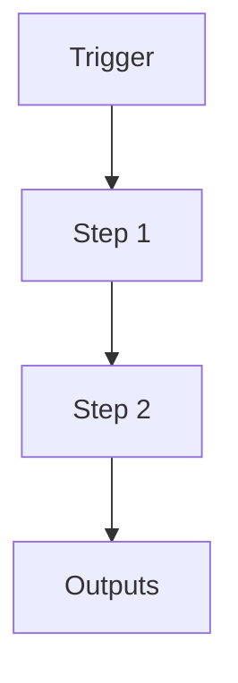

# Hybrid RAG Layer for N5 Cognition

```yaml
# Zone 2: Capability metadata (machine-readable)
capability_id: hybrid-rag-layer-v1
name: Hybrid RAG Layer for N5 Cognition
category: internal
status: active
confidence: medium
last_verified: '2025-12-12'
tags: []
entry_points:
- type: script
  id: N5/scripts/semantic_reindex_service.py
- type: script
  id: N5/cognition/n5_memory_client.py
- type: script
  id: N5/scripts/semantic_memory_quality_test.py
owner: V
version: '1.0'
description: Implements a large-model semantic index across Knowledge, N5 system docs,
  Lists, Articles, Documents (scoped), and meeting blocks using `text-embedding-3-large`.
  Adds a hybrid RAG layer combining BM25 keyword search, semantic embeddings, markdown-aware
  chunking, reranking, and metadata filters. Enables high-precision recall over Careerspan
  strategy, system docs, and meeting intelligence for downstream tools and prompts.
files:
- N5/scripts/semantic_reindex_service.py
- N5/cognition/n5_memory_client.py
- N5/logs/semantic_memory_test_20251212.md
- N5/builds/semantic-cleanup-v1/PLAN.md
```

## What This Does

Implements a large-model semantic index across Knowledge, N5 system docs, Lists, Articles, Documents (scoped), and meeting blocks using `text-embedding-3-large`. Adds a hybrid RAG layer combining BM25 keyword search, semantic embeddings, markdown-aware chunking, reranking, and metadata filters. Enables high-precision recall over Careerspan strategy, system docs, and meeting intelligence for downstream tools and prompts.

## How to Use It

- How to trigger it (prompts, commands, UI entry points)
- Typical usage patterns and workflows

## Associated Files & Assets

List key implementation and configuration files using `file '...'` syntax where helpful.

## Workflow

Describe the execution flow. Optionally include a mermaid diagram.



## Notes / Gotchas

- Edge cases
- Preconditions
- Safety considerations
