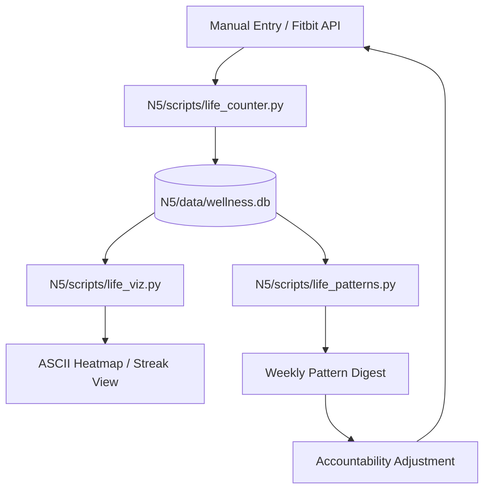

# Life Counter

```yaml
# Zone 2: Capability metadata (machine-readable)
capability_id: life-counter
name: Life Counter
category: internal
status: active
confidence: high
last_verified: '2026-01-09'
tags: [wellness, habits, tracking, fitness, productivity]
owner: V
purpose: |
  A robust SQLite-backed tracking system designed to log daily habit increments and generate GitHub-style contribution visualizations to reinforce positive behaviors and eliminate negative ones.
components:
  - N5/data/wellness.db
  - N5/scripts/life_counter.py
  - N5/scripts/life_viz.py
  - N5/scripts/life_accountability.py
  - N5/scripts/life_patterns.py
  - N5/scripts/fitbit_life_bridge.py
  - Prompts/Life Counter.prompt.md
operational_behavior: |
  Operates via a centralized SQLite database that stores category metadata (habit type, sentiment) and timestamped logs. It ingests data from manual CLI increments, automated Fitbit syncs, and periodic accountability checks, providing visual feedback via ASCII heatmaps and correlation reports.
interfaces:
  - prompt: "@Life Counter" (Natural language logging and visualization)
  - cli: "python3 N5/scripts/life_counter.py [increment|list|ledger|scoreboard|stats|today]"
  - cli: "python3 N5/scripts/life_viz.py [graph|heatmap|streak]"
  - scheduled_task: "Fitbit Sync (Daily 8:00 AM)"
  - scheduled_task: "Life Counter Reminders (Integrated check-ins)"
quality_metrics: |
  Success is defined by zero-latency logging of manual entries, 100% reliability of the 8 AM Fitbit sync, and the generation of accurate weekly correlation insights between sleep and habit spikes.
```

## What This Does

Life Counter is a "GitHub for Life" habit tracking system that treats personal growth like version control. It provides a structured way to quantify daily actions—both positive (meditation, workouts) and negative (smoking, weed)—storing them in a persistent database for long-term trend analysis. The system exists to transform abstract intentions into concrete data, using visualization and correlation to help V understand the environmental factors (like sleep) that drive behavior patterns.

## How to Use It

### Prompts
The easiest way to interact is via the `file 'Prompts/Life Counter.prompt.md'`. You can say:
* "@Life Counter increment workout"
* "@Life Counter show my weed heatmap"
* "@Life Counter status for today"

### CLI Commands
For direct execution in the terminal:
* **Logging:** `python3 N5/scripts/life_counter.py increment <category> [value]`
* **Views:** 
    * `python3 N5/scripts/life_counter.py ledger` (Bad habits and clean streaks)
    * `python3 N5/scripts/life_counter.py scoreboard` (Good habits and momentum)
* **Visualization:** `python3 N5/scripts/life_viz.py graph <category>`

### Automated Sync
Workouts are automatically pulled from Fitbit every morning at 8:00 AM via the `file 'N5/scripts/fitbit_life_bridge.py'` and populated into the `workout` category.

## Associated Files & Assets

* `file 'N5/data/wellness.db'`: The SQLite source of truth for all habit data.
* `file 'N5/scripts/life_counter.py'`: The primary engine for data entry and management.
* `file 'N5/scripts/life_viz.py'`: Generates ASCII contribution graphs and heatmaps.
* `file 'N5/scripts/life_patterns.py'`: Runs correlation analysis (e.g., Sleep vs. Bad Habits).
* `file 'N5/scripts/life_accountability.py'`: Manages daily pings and habit status checks.
* `file 'N5/scripts/fitbit_life_bridge.py'`: Handles the API bridge between Fitbit and the local database.

## Workflow

The system follows a continuous loop of ingestion, visualization, and insight generation.



## Notes / Gotchas

* **Category Sentiment:** Categories must be assigned a sentiment (`good`, `bad`, or `neutral`) in the `life_categories` table to appear correctly in the `ledger` vs. `scoreboard` views.
* **Manual vs. Auto:** Fitbit logs are tagged with `source='fitbit'`. Manual overrides are possible but will be stored as separate log entries.
* **Sleep Correlation:** The correlation engine requires at least 7 days of concurrent sleep and habit data to generate meaningful "Bad habit spike" warnings.
* **Privacy:** All data is stored locally in `file 'N5/data/wellness.db'` and is not synced to external clouds except for the initial Fitbit pull.

03:40:00 ET