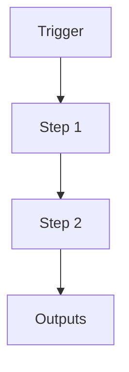

# Linkedin Knowledge Extraction

```yaml
# Zone 2: Capability metadata (machine-readable)
capability_id: linkedin-knowledge-extraction
name: Linkedin Knowledge Extraction
category: internal
status: active
confidence: high
last_verified: '2026-01-12'
tags: []
owner: V
purpose: |
  [LLM: Write 1-2 sentence purpose based on PLAN.md]
components:
  # [LLM: List key files from the build]
  - N5/builds/linkedin-knowledge-extraction/PLAN.md
operational_behavior: |
  [LLM: Describe how this capability operates]
interfaces:
  # [LLM: List entry points - prompts, scripts, commands]
  - TBD
quality_metrics: |
  [LLM: Define success criteria]
```

## What This Does

[LLM: Write 2-5 sentences describing what this capability does and why it exists. 
Reference the PLAN.md content below for context.]

## How to Use It

[LLM: Describe how to trigger/use this capability. Include:
- Prompts (if applicable)
- Commands (if applicable)  
- UI entry points (if applicable)]

## Associated Files & Assets

[LLM: List key implementation files using `file '...'` syntax]

## Workflow

[LLM: Describe the execution flow. Include mermaid diagram if helpful.]



## Notes / Gotchas

[LLM: Document edge cases, preconditions, safety considerations]

---

## Build Context (for LLM reference - remove after completion)

### PLAN.md Excerpt
```
---
created: 2026-01-12
last_edited: 2026-01-12
version: 1.0
provenance: con_zTfB7kehxEEHmaoC
---

# Build Plan: LinkedIn Knowledge Extraction

## Objective

Extract structured value from V's LinkedIn corpus (130 posts, 3 articles, 689 comments) and populate:
1. **Content Library** — Best original, evergreen posts archived as reusable social content
2. **Positions System** — Worldview positions extracted and indexed (extend existing if ≥50% overlap)
3. **Psychographic Portrait** — Synthesis-level analysis of V as a LinkedIn presence

## Key Decisions (from V)

- **Position overlap ≥50%**: Extend existing position, do not create new or flag
- **Top post criteria**: Originality + Evergreen only (not reshares, still relevant)
- **Portrait depth**: Synthesis/semantic level (voice library has linguistic artifacts)

## Data Sources

| Source | Records | Path |
|--------|---------|------|
| Posts | 130 | `Datasets/linkedin-full-pre-jan-10/source/extracted/Shares.csv` |
| Articles | 3 | `Datasets/linkedin-full-pre-jan-10/source/extracted/Articles/Articles/*.html` |
| Comments | 689 | `Datasets/linkedin-full-pre-jan-10/source/extracted/Comments.csv` |

## Phase Checklist

### Phase 0: Foundation (W0)
- [x] Extract posts to `posts.jsonl` (date, text, URLs, visibility, is_reshare flag)
- [x] Extract articles to `articles.jsonl` (title, full text from HTML)
- [x] Extract comments to `comments.jsonl` (date, text, link)
- [x] Validate record counts match source

**Affected files:**
- `Datasets/linkedin-full-pre-jan-10/source/extracted/Shares.csv` (read)
- `Datasets/linkedin-full-pre-jan-10/source/extracted/Articles/Articles/*.html` (read)
- `Datasets/linkedin-full-pre-jan-10/source/extracted/Comments.csv` (read)
- Conversation workspace: `posts.jsonl`, `articles.jsonl`, `comments.jsonl` (write)

### Phase 1: Parallel Analysis (W1, W2, W3)

#### W1: Thematic Coding
- [ ] Topic frequency distribution across posts
- [ ] Emotional markers (frustration, excitement, advocacy, humor)
- 
```

### STATUS.md Excerpt  
```
---
created: 2026-01-12
last_edited: 2026-01-12
version: 1.0
provenance: con_zTfB7kehxEEHmaoC
---

# Build Status: LinkedIn Knowledge Extraction

## Current Phase: COMPLETE ✅

## Overall Progress: 7/7 workers (100%)

## Worker Status

| Worker | Description | Status | Assignment |
|--------|-------------|--------|------------|
| W0 | Data Extraction & Prep | ✅ Complete | `workers/W0_data_extraction.md` |
| W1 | Psychographic Analysis | ✅ Complete | `workers/W1_psychographic_analysis.md` |
| W2 | Top Posts Selection | ✅ Complete | `workers/W2_content_selection.md` |
| W3 | Position Extraction | ✅ Complete | `workers/W3_position_extraction.md` |
| W2b | Content Library Ingest | ✅ Complete | `workers/W2b_content_ingestion.md` |
| W3b | Position Integration | ✅ Complete | `workers/W3b_position_integration.md` |
| W4 | Portrait Synthesis | ✅ Complete | `workers/W4_portrait_synthesis.md` |

## Dependency Graph

```
W0 (Data Extraction)
 ├── W1 (Psychographic) ────────────────┐
 ├── W2 (Top P
```
