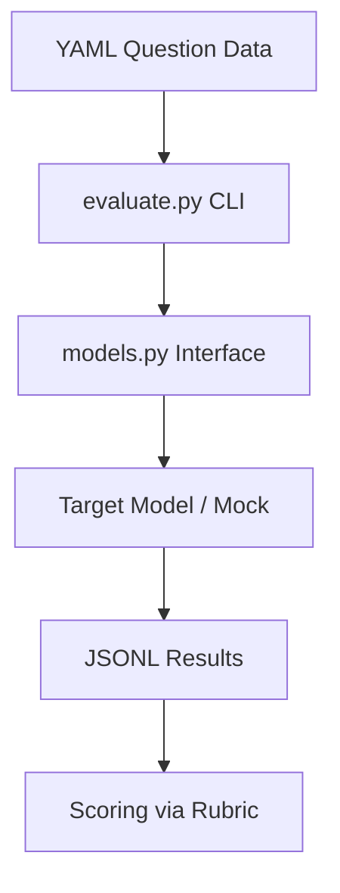

# Memebench

```yaml
# Zone 2: Capability metadata (machine-readable)
capability_id: memebench
name: Memebench
category: internal
status: active
confidence: high
last_verified: '2026-01-09'
tags: [benchmark, llm-eval, culture, memes]
owner: V
purpose: |
  A framework for testing AI models' ability to interpret complex meme culture, 
  including layered irony, sociological subtext, and temporal cultural references.
components:
  - Projects/memebench/README.md
  - Projects/memebench/categories/
  - Projects/memebench/scoring/rubric.yaml
  - Projects/memebench/src/evaluate.py
  - Projects/memebench/src/models.py
  - Projects/memebench/data/sample.yaml
operational_behavior: |
  Operates as a CLI-driven evaluation harness that passes structured YAML 
  meme descriptions to model interfaces and logs results in JSONL format for 
  multi-dimensional scoring against a 5-dimension rubric.
interfaces:
  - python3 Projects/memebench/src/evaluate.py --input <yaml_file> --model <model_id>
quality_metrics: |
  Success is defined by the harness's ability to parse YAML questions, 
  execute model calls via the standard interface, and generate a JSONL 
  output compatible with the 1-5 scoring rubric.
```

## What This Does

MemeBench is an AI cultural zeitgeist benchmark designed to measure an LLM's "cultural literacy" rather than simple image recognition. It provides a structured framework to test if a model understands the deeper sociological subtext and "meta-irony" present in modern internet culture. This was built as a pilot project to master benchmark construction before moving on to more complex implementations like GestaltBench.

## How to Use It

The system is currently in a scaffold state and is operated via the command line within the `Projects/memebench/` directory.

- **Run Evaluation:** Use the `evaluate.py` script to run questions through a model.
  ```bash
  python3 src/evaluate.py --input data/sample.yaml --model mock --output results.jsonl
  ```
- **Review Categories:** Inspect the `categories/` directory to understand the 6 core dimensions of the benchmark (e.g., Absurdist Meta-Irony, Corporate Cringe).
- **Modify Rubric:** Adjust the scoring dimensions in `scoring/rubric.yaml`.
- **Add Questions:** Author new benchmark questions in YAML format following the structure in `data/sample.yaml`.

## Associated Files & Assets

- file 'Projects/memebench/README.md' - Project overview and philosophy
- file 'Projects/memebench/src/evaluate.py' - Main CLI evaluation harness
- file 'Projects/memebench/src/models.py' - Model interface definitions
- file 'Projects/memebench/scoring/rubric.yaml' - Multi-dimensional scoring framework
- file 'Projects/memebench/data/sample.yaml' - Sample benchmark questions
- file 'Projects/memebench/categories/' - Definitions for the 6 benchmark categories

## Workflow

The execution flow involves taking structured cultural prompts and passing them through a model adapter to generate parseable evaluation results.



## Notes / Gotchas

- **Synthetic Descriptions:** Phase 1 uses text-based descriptions of memes rather than raw images to isolate semantic understanding from computer vision capabilities.
- **Mock Model:** The current implementation defaults to a `MockModel` for testing the harness; real model integration (OpenAI/Claude) is slated for Phase 4.
- **Append-Only Results:** The output format is JSONL to ensure results are safely logged even if a large batch process is interrupted.