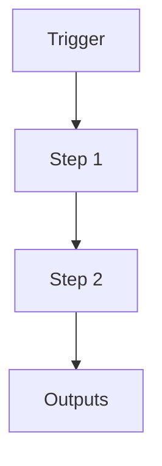

# N5 Ignore Marker System

```yaml
# Zone 2: Capability metadata (machine-readable)
capability_id: n5-ignore-system
name: N5 Ignore Marker System
category: internal
status: active
confidence: high
last_verified: 2025-12-15
tags:
- system
- indexing
- organization
entry_points:
- type: script
  id: N5/scripts/n5_ignore.py
owner: V
change_type: new
capability_file: N5/capabilities/internal/n5-ignore-system.md
description: 'Marker system for excluding directories from N5 operations. Directories
  containing

  .n5ignored files are treated as non-existent by index rebuilds and other N5 tools.

  Parallel to .n5protected but for deprecation/archival rather than protection.

  '
associated_files:
- N5/scripts/n5_ignore.py
- N5/scripts/n5_index_rebuild.py
```

## What This Does

Marker system for excluding directories from N5 operations. Directories containing
.n5ignored files are treated as non-existent by index rebuilds and other N5 tools.
Parallel to .n5protected but for deprecation/archival rather than protection.

## How to Use It

- How to trigger it (prompts, commands, UI entry points)
- Typical usage patterns and workflows

## Associated Files & Assets

List key implementation and configuration files using `file '...'` syntax where helpful.

## Workflow

Describe the execution flow. Optionally include a mermaid diagram.



## Notes / Gotchas

- Edge cases
- Preconditions
- Safety considerations
