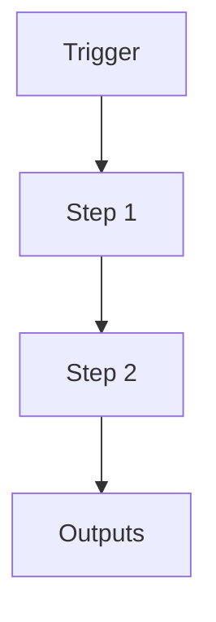

# N5OS Health Sentinel

```yaml
# Zone 2: Capability metadata (machine-readable)
capability_id: n5os-health-sentinel
name: N5OS Health Sentinel
category: internal
status: active
confidence: medium
last_verified: '2025-12-16'
tags: []
owner: V
purpose: Proactive system monitoring to detect drift, resource exhaustion, and service
  failures with alerting capabilities.
components:
- N5/scripts/maintenance/health_sentinel.py
- N5/config/health_sentinel.yaml
- N5/data/health_sentinel_digest.json
operational_behavior: Runs periodically (every 30 mins), checks resources, services,
  log sizes, and DB locks. Alerts via SMS on emergency, writes to digest on degradation.
interfaces:
- health_sentinel_digest.json
- CLI execution
quality_metrics: Accurate detection of DEGRADED status when services are stale, timely
  alerts.
```

## What This Does

Brief overview (2–5 sentences) of what this capability does and why it exists.

## How to Use It

- How to trigger it (prompts, commands, UI entry points)
- Typical usage patterns and workflows

## Associated Files & Assets

List key implementation and configuration files using `file '...'` syntax where helpful.

## Workflow

Describe the execution flow. Optionally include a mermaid diagram.



## Notes / Gotchas

- Edge cases
- Preconditions
- Safety considerations
