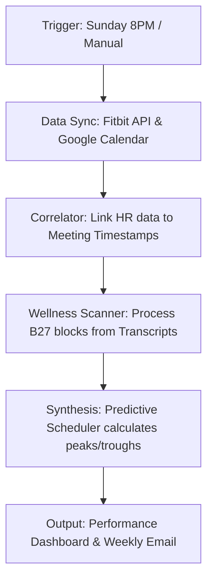

# Performance Intelligence

```yaml
# Zone 2: Capability metadata (machine-readable)
capability_id: performance-intelligence
name: Performance Intelligence
category: internal
status: active
confidence: high
last_verified: '2026-01-09'
tags: [biometrics, health, productivity, optimization]
owner: V
purpose: |
  Correlates biometric data from Fitbit with cognitive output and calendar events to identify optimal performance patterns and stress triggers.
components:
  - N5/builds/performance-intelligence/PLAN.md
  - N5/scripts/calendar_hr_correlator.py
  - N5/scripts/predictive_scheduler.py
  - N5/scripts/performance_dashboard.py
  - Prompts/Blocks/Generate_B27.prompt.md
  - N5/data/performance.db
operational_behavior: |
  Operates as an automated weekly synthesis system that pulls intraday heart rate, sleep scores, and HRV, then joins them against calendar events and meeting transcripts to generate a performance dashboard and predictive scheduling recommendations.
interfaces:
  - prompt: "@Generate_B27" (Extracts wellness indicators from transcripts)
  - command: "python3 N5/scripts/performance_dashboard.py" (Generates manual report)
  - automation: "Sunday 8 PM Weekly Synthesis" (Email delivery)
quality_metrics: |
  Successful correlation of 95%+ of calendar events with biometric data; delivery of weekly dashboard with <5% error rate on database joins.
```

## What This Does

Performance Intelligence is a holistic system designed to provide V with data-driven insights into his physiological and cognitive states. By correlating intraday heart rate data, HRV, and sleep metrics with meeting density and transcript sentiment, the system identifies stress patterns (such as meeting-induced HR spikes) and validates hypotheses like the "2pm energy drop." It ultimately serves as a decision-support engine for optimizing V's weekly schedule based on his unique biometric recovery patterns and performance peaks.

## How to Use It

This capability is primarily hands-off, governed by a weekly automation, but can be triggered manually for specific insights:

- **Weekly Report:** Every Sunday at 8:00 PM ET, the system automatically emails a synthesized performance report and schedule recommendations for the coming week.
- **Transcript Analysis:** Use the `tool: Generate_B27` prompt (or `@Generate B27` in chat) during meeting processing to extract wellness indicators and stress signals directly from a transcript.
- **Manual Dashboard:** Run `python3 N5/scripts/performance_dashboard.py` to generate an on-demand view of recent performance correlations.
- **Predictive Scheduling:** Consult the recommendations in `Personal/Health/Reports/` before planning high-stakes meetings to ensure they align with historical peak performance windows.

## Associated Files & Assets

- file 'N5/scripts/calendar_hr_correlator.py' — Core logic for joining biometrics with calendar events.
- file 'N5/scripts/predictive_scheduler.py' — Engine that generates optimization recommendations.
- file 'N5/scripts/performance_dashboard.py' — Synthesizes data into the weekly unified report.
- file 'Prompts/Blocks/Generate_B27.prompt.md' — LLM prompt for wellness extraction.
- file 'N5/data/performance.db' — Central SQLite database for performance correlations.
- file 'Personal/Health/Reports/' — Canonical storage for weekly generated insights.

## Workflow

The system follows a sequence of data ingestion, correlation, and synthesis to transform raw biometrics into actionable intelligence.



## Notes / Gotchas

- **Data Latency:** Fitbit intraday data requires a successful sync; if the watch has not synced to the cloud recently, the report may show gaps.
- **Baseline Sensitivity:** The stress indicator relies on a 30-minute pre-meeting HR baseline. High activity (e.g., walking to a meeting) immediately before a session can skew stress deltas.
- **Database Locks:** Avoid manual edits to file 'N5/data/performance.db' while the weekly automation is running to prevent write contention.
- **Privacy:** As this system contains high-granularity biometric data, all reports are stored in protected `Personal/Health/` directories.

2026-01-09 03:45:00 ET