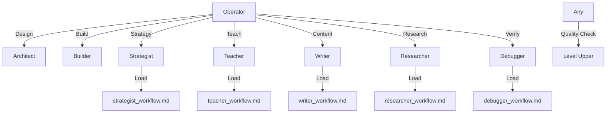

# Persona System v4.0 (Leveled Up)

```yaml
capability_id: persona-system-v2
name: "Persona System v4.0 (Leveled Up)"
category: internal
status: active
confidence: high
last_verified: 2025-12-16
tags:
  - personas
  - system
  - routing
  - workflows
entry_points:
  - type: doc
    id: "Documents/System/PERSONAS_README.md"
  - type: workflow_lib
    id: "N5/prefs/workflows/"
owner: "V"
```

## What This Does

Major upgrade to the N5 Persona System (v4.0). Decouples "rich methodology" from system prompts by introducing external **Workflow Files** (`N5/prefs/workflows/*.md`) loaded on demand.

**Key upgrades:**
- **Strategist v4.0:** 3-mode operation (Analysis/Ideation/Integrated) + explicit quality gates.
- **Researcher v4.0:** 5-phase rigor + "Steel Man" requirement + citation discipline.
- **Teacher v4.0:** 10-15% stretch calibration + Socratic mode + mandatory validation.
- **Writer v4.0:** V-voice principles + content templates + anti-pattern checks.
- **Debugger v4.0:** 5-phase verification + root cause categorization (Plan/Principle/Bug).

## How to Use It

- **Operator (default):** Handles execution mechanics.
- **Specialists:** Invoke by name. The persona prompt is now lightweight but references a detailed workflow file.
- **Workflow Files:** Located in `N5/prefs/workflows/`. AI loads these when entering deep work modes.

## Associated Files & Assets

- `file 'Documents/System/PERSONAS_README.md'` - System index
- `file 'N5/prefs/workflows/strategist_workflow.md'` - Strategist methodology
- `file 'N5/prefs/workflows/researcher_workflow.md'` - Researcher methodology
- `file 'N5/prefs/workflows/teacher_workflow.md'` - Teacher methodology
- `file 'N5/prefs/workflows/writer_workflow.md'` - Writer methodology
- `file 'N5/prefs/workflows/debugger_workflow.md'` - Debugger methodology
- `file 'N5/prefs/system/persona_routing_contract.md'` - Routing logic

## Workflow



