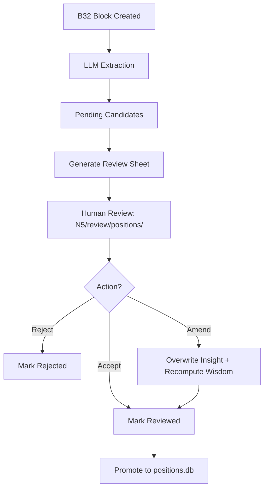

# Position Extraction V2

```yaml
# Zone 2: Capability metadata (machine-readable)
capability_id: position-extraction-v2
name: Position Extraction V2
category: internal
status: active
confidence: high
last_verified: '2026-01-09'
tags: [positions, hitl, extraction, wisdom]
owner: V
purpose: |
  Extracts structured "wisdom" (reasoning, stakes, conditions) from meeting intelligence (B32 blocks) 
  and enforces a human-in-the-loop (HITL) review process via editable markdown sheets before promotion to positions.db.
components:
  - N5/builds/position-extraction-v2/PLAN.md
  - N5/scripts/b32_position_extractor.py
  - N5/scripts/positions.py
  - N5/scripts/tension_detector.py
  - N5/review/positions/
  - positions.db
operational_behavior: |
  Operates as a multi-stage pipeline: (1) LLM extraction of candidates from B32 blocks into a pending state, 
  (2) generation of desktop-editable markdown review sheets, (3) ingestion of human decisions (accept/amend/reject), 
  and (4) recomputation of wisdom fields for amended insights before final promotion.
interfaces:
  - CLI: python3 N5/scripts/b32_position_extractor.py [extract|review-sheet-generate|review-sheet-ingest|promote-reviewed]
  - Prompts: @Position Triage, @Position Seed Interview
  - Files: N5/review/positions/YYYY-MM-DD_positions-review_batch-XXX.md
quality_metrics: |
  - Zero claims promoted without HITL approval.
  - 100% of promoted positions contain non-null 'reasoning', 'stakes', and 'conditions' fields.
  - Successful recomputation of wisdom fields following 'amend' operations.
```

## What This Does

Position Extraction V2 upgrades the system from capturing flat "claims" to preserving structured "wisdom." It identifies core insights from meeting intelligence and extracts the underlying principle (reasoning), the implications for action (stakes), and the boundary cases (conditions). Crucially, it introduces a formal Human-in-the-Loop (HITL) gate where V can review, amend, or reject candidates via simple markdown files before they are indexed in the long-term memory.

## How to Use It

### 1. Extract Candidates
The system automatically extracts candidates from new B32 blocks, but you can trigger it manually:
`python3 N5/scripts/b32_position_extractor.py extract`

### 2. Generate Review Sheet
Create a desktop-editable sheet for pending candidates:
`python3 N5/scripts/b32_position_extractor.py review-sheet-generate --status pending --limit 10`

### 3. Review & Amend
Open the generated file in `file 'N5/review/positions/'`. For each candidate, update the status to `accept`, `reject`, or `amend`. If amending, rewrite the `insight` text directly in the file.

### 4. Ingest & Promote
Once the sheet is saved, ingest the decisions:
`python3 N5/scripts/b32_position_extractor.py review-sheet-ingest <path_to_sheet.md>`

Finally, promote the approved items to the permanent database:
`python3 N5/scripts/b32_position_extractor.py promote-reviewed`

## Associated Files & Assets

- `file 'N5/scripts/b32_position_extractor.py'` — The primary orchestrator for extraction and HITL workflows.
- `file 'N5/scripts/positions.py'` — Database interface for `positions.db`.
- `file 'N5/scripts/tension_detector.py'` — Scans for contradictions between new candidates and existing positions.
- `file 'N5/review/positions/'` — Canonical directory for HITL review sheets.

## Workflow



## Notes / Gotchas

- **Recomputation:** When an insight is "amended" in a review sheet, the system automatically triggers an LLM call to re-derive the `reasoning`, `stakes`, and `conditions` based on your new text and the original source context.
- **Traceability:** Even after an amendment, the `original_excerpt` and `source_excerpt` are preserved for provenance.
- **Near-Duplicates:** The current version allows near-duplicate positions to be promoted; deduplication is treated as a downstream quality-tuning step.
- **ReadOnly Fields:** `domain`, `speaker`, and `source_excerpt` are not updated during the amendment process to maintain integrity.

2026-01-09 03:40:00 ET