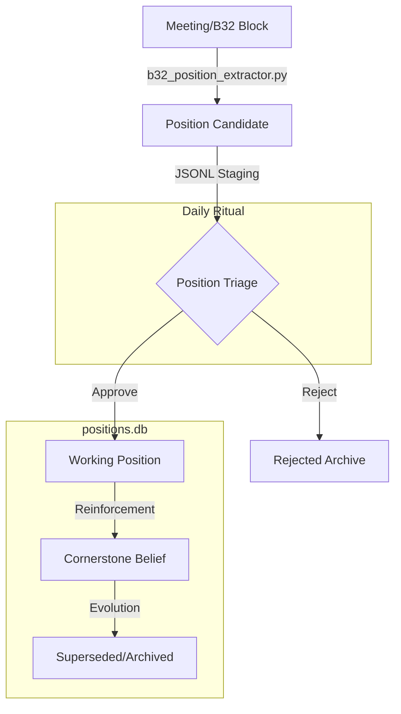

# Position Tracker

```yaml
# Zone 2: Capability metadata (machine-readable)
capability_id: position-tracker
name: Position Tracker
category: internal
status: active
confidence: high
last_verified: '2026-01-09'
tags: [worldview, knowledge-graph, synthesis, triage]
owner: V
purpose: |
  Tracks V's intellectual positions over time, capturing the crystallization of raw ideas into working positions and cornerstone beliefs to build cumulative intellectual capital.
components:
  - N5/builds/position-tracker/PLAN_V3_SIMPLIFIED.md
  - N5/scripts/b32_position_extractor.py
  - N5/prompts/extract_positions_from_b32.md
  - N5/data/position_candidates.jsonl
  - N5/data/b32_processed.jsonl
  - Prompts/Position Triage.prompt.md
operational_behavior: |
  Automatically extracts position candidates from B32 (Thought Provoking Ideas) blocks in meeting transcripts, stages them for human-in-the-loop triage, and promotes approved insights to the core positions database.
interfaces:
  - prompt: "@Position Triage"
  - script: "python3 N5/scripts/b32_position_extractor.py"
  - script: "python3 N5/scripts/positions.py"
quality_metrics: |
  - Extraction noise floor: <30% irrelevant candidates
  - Triage latency: Daily ritual to prevent backlog accumulation
  - Traceability: Full link from cornerstone back to source meeting excerpt
```

## What This Does

The Position Tracker is a worldview knowledge graph system designed to observe and document how V's thinking evolves. It solves the problem of "intellectual leakage" by ensuring that unique insights shared in meetings or reflections are captured, attributed (distinguishing V's voice from external wisdom), and systematically reviewed. By tracking the lifecycle of a claim from a raw idea to a cornerstone belief, the system builds a searchable, grounded repository of "what V thinks about X," which can be used for content generation, strategic decision-making, and identifying intellectual contradictions.

## How to Use It

### 1. Extraction
The system monitors meeting intelligence blocks (specifically B32) to find new claims. You can trigger this manually:
- **Scan recent meetings:** `python3 N5/scripts/b32_position_extractor.py scan --limit 10`
- **Extract from a specific file:** `python3 N5/scripts/b32_position_extractor.py extract <path/to/B32.md>`

### 2. Triage Ritual
To review pending insights and promote them to your permanent record:
- **Run the Triage Prompt:** Type `@Position Triage` in the chat.
- **Manual CLI List:** `python3 N5/scripts/b32_position_extractor.py list-pending`

### 3. Management
- **Promote to Working/Cornerstone:** Use `python3 N5/scripts/positions.py add --domain <domain> --title "<title>" --insight "<claim>"`
- **Mark Candidate Status:** `python3 N5/scripts/b32_position_extractor.py mark <cand_id> approved|rejected`

## Associated Files & Assets

- Plan File: file 'N5/builds/position-tracker/PLAN_V3_SIMPLIFIED.md'
- Extraction Logic: file 'N5/scripts/b32_position_extractor.py'
- Staging Database: file 'N5/data/position_candidates.jsonl'
- Triage Interface: file 'Prompts/Position Triage.prompt.md'
- Core Database Interface: file 'N5/scripts/positions.py'

## Workflow

The system follows a linear progression from raw signal to structured belief, gated by a human-in-the-loop triage step.



## Notes / Gotchas

- **B32 Dependency:** The current extractor relies on the existence of B32 (Thought Provoking Ideas) blocks. If a meeting isn't processed through the standard intelligence pipeline, the position will not be auto-captured.
- **Noise Floor:** AI extraction may occasionally capture generic statements. The Triage step is essential to maintain the high signal-to-noise ratio required for a "Cornerstone" database.
- **Deduplication:** The current simplified version requires manual check for duplicates during triage; automated semantic dedup is scheduled for Phase 4.
- **Speaker Attribution:** Ensure the `speaker` tag is correctly set during triage if the insight came from an external participant rather than V.

2026-01-09 03:42:00 ET