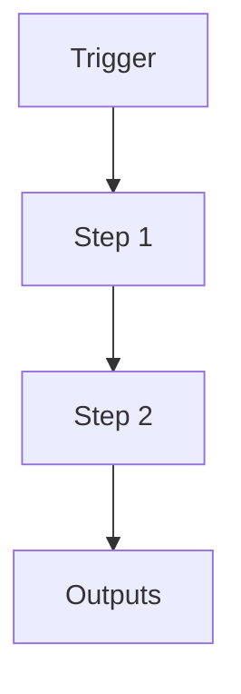

# Project Log (System Wisdom)

```yaml
# Zone 2: Capability metadata (machine-readable)
capability_id: project-log
name: Project Log (System Wisdom)
category: internal
status: active
confidence: high
last_verified: 2025-12-11
tags:
- knowledge
- wisdom
- logging
entry_points:
- type: script
  id: N5/scripts/n5_project_log.py
owner: V
change_type: new
description: 'Centralized log for capturing architectural, process, and tooling lessons
  (System Wisdom) from threads.

  '
associated_files:
- N5/scripts/n5_project_log.py
- N5/data/project_log.jsonl
```

## What This Does

Centralized log for capturing architectural, process, and tooling lessons (System Wisdom) from threads.

## How to Use It

- How to trigger it (prompts, commands, UI entry points)
- Typical usage patterns and workflows

## Associated Files & Assets

List key implementation and configuration files using `file '...'` syntax where helpful.

## Workflow

Describe the execution flow. Optionally include a mermaid diagram.



## Notes / Gotchas

- Edge cases
- Preconditions
- Safety considerations
