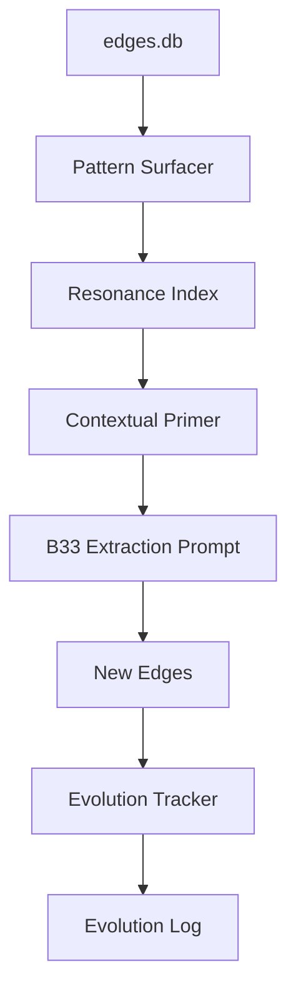

# Resonance Reservoir

```yaml
# Zone 2: Capability metadata (machine-readable)
capability_id: resonance-reservoir
name: Resonance Reservoir
category: internal
status: active
confidence: high
last_verified: '2026-01-10'
tags: [context-graph, resonance, semantic-memory]
owner: V
purpose: |
  Distinguishes between V's established mental models (patterns) and novel ideas (sparks) within the Context Graph.
components:
  - N5/scripts/resonance/pattern_surfacer.py
  - N5/scripts/resonance/contextual_primer.py
  - N5/scripts/resonance/evolution_tracker.py
  - N5/scripts/resonance/daily_maintenance.py
  - N5/data/resonance_index.json
operational_behavior: |
  Categorizes ideas into L0-L3 hierarchy based on frequency and injects this context into future extractions to prioritize novelty.
interfaces:
  - prompt "Prompts/Resonance Report.prompt.md"
  - python3 N5/scripts/resonance/pattern_surfacer.py report
  - python3 N5/scripts/resonance/daily_maintenance.py regenerate
quality_metrics: |
  Net reduction in redundant spark extractions; accurate classification of L0 Cornerstones.
```

## What This Does

The **Resonance Reservoir** acts as a "semantic memory" layer for V's Context Graph system. Instead of treating every mention of an idea as a new extraction, it classifies ideas into a four-level hierarchy (Cornerstone, Active Thesis, Recurring Tool, Spark) based on their frequency across meeting sessions. This prevents "slug fragmentation" and ensures that the system focuses on capturing genuinely novel thinking or significant evolutions of established beliefs, rather than repetitive restatements of known frameworks.

## How to Use It

- **View Intellectual Landscape:** Run `prompt "Prompts/Resonance Report.prompt.md"` to see the current hierarchy and any recent evolution events or "decay watch" candidates.
- **Manual Maintenance:** Run `python3 N5/scripts/resonance/daily_maintenance.py regenerate` to manually refresh the resonance index and daily report.
- **Extraction Context:** The system automatically injects resonance context into `B33 Decision Edge` extractions via the `contextual_primer.py` script.

## Associated Files & Assets

- `file 'N5/scripts/resonance/pattern_surfacer.py'` — The classification engine.
- `file 'N5/scripts/resonance/contextual_primer.py'` — Injects memory into the LLM extractor.
- `file 'N5/scripts/resonance/evolution_tracker.py'` — Detects pivots in established ideas.
- `file 'N5/scripts/resonance/daily_maintenance.py'` — Orchestrates daily index updates.
- `file 'N5/data/resonance_index.json'` — The source of truth for idea resonance levels.
- `file 'N5/data/evolution_log.jsonl'` — Logs of detected intellectual pivots.

## Workflow



## Notes / Gotchas

- **L0 Threshold:** Requires 10+ distinct session mentions to graduate to a Cornerstone.
- **Slug Consistency:** Relies on the `apply_aliases.py` script to maintain a clean namespace (semantic consolidation).
- **Additive Second Pass:** For historical meetings, a "Second Pass" agent uses this capability to catch non-career ideas missed in initial narrow scans.

