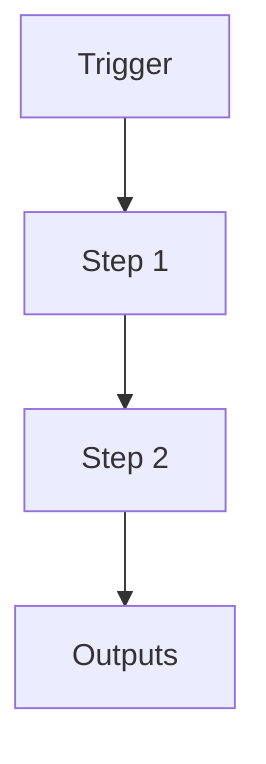

# Safety & Scheduling Wrapper

```yaml
# Zone 2: Capability metadata (machine-readable)
capability_id: safety-scheduling-wrapper
name: Safety & Scheduling Wrapper
category: internal
status: active
confidence: medium
last_verified: '2025-12-16'
tags: []
owner: V
purpose: Enforce execution policies (locks, timeouts, retries) and safety checks (arrest
  flags) for scheduled tasks.
components:
- N5/scripts/n5_schedule_wrapper.py
operational_behavior: Wraps command execution, checks ARREST_SYSTEM.json flag, manages
  exclusive locks, handles retries and backoff.
interfaces:
- CLI wrapper (python3 n5_schedule_wrapper.py <cmd>)
quality_metrics: Successful execution of wrapped commands, reliable blocking when
  system is arrested.
```

## What This Does

Brief overview (2–5 sentences) of what this capability does and why it exists.

## How to Use It

- How to trigger it (prompts, commands, UI entry points)
- Typical usage patterns and workflows

## Associated Files & Assets

List key implementation and configuration files using `file '...'` syntax where helpful.

## Workflow

Describe the execution flow. Optionally include a mermaid diagram.



## Notes / Gotchas

- Edge cases
- Preconditions
- Safety considerations
