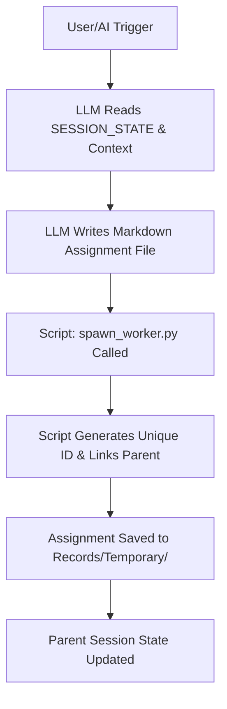

# Spawn Worker Refactor

```yaml
# Zone 2: Capability metadata (machine-readable)
capability_id: spawn-worker-refactor
name: Spawn Worker Refactor
category: internal
status: active
confidence: high
last_verified: '2026-01-09'
tags: [infrastructure, agents, decomposition, refactor]
owner: V
purpose: |
  Refactor the worker spawning system to move semantic responsibility from brittle Python scripts to the LLM, ensuring high-quality, context-aware worker assignments.
components:
  - N5/builds/spawn-worker-refactor/PLAN.md
  - N5/scripts/spawn_worker.py
  - Prompts/Spawn Worker.prompt.md
operational_behavior: |
  Operates as an LLM-first workflow where the script functions as pure "plumbing" for file I/O and ID generation, while the AI performs deliberate decomposition of tasks into markdown-based assignments.
interfaces:
  - prompt: "@Spawn Worker"
  - script: "python3 N5/scripts/spawn_worker.py --parent <ID> --content-file <path>"
  - flag: "--generate-ids" (for ID-only generation)
quality_metrics: |
  - Zero reliance on script-based templates for content generation.
  - Successful linkage between parent SESSION_STATE and child worker files.
  - Strict failure if assignment content is missing or too short.
```

## What This Does

This capability transforms the "Spawn Worker" system from a mechanical, template-driven script into a deliberate semantic decomposition tool. It removes the previous reliance on brittle regex parsing and generic fallbacks in `spawn_worker.py`, forcing the LLM to consciously read the session context, scope the required work, and author a complete, high-signal markdown assignment. This ensures that parallel workers receive high-quality instructions that are actually useful for execution, rather than garbage content generated by script templates.

## How to Use It

### Prompts
Invoke the `@Spawn Worker` prompt in chat when a task needs to be decomposed into parallel sub-tasks. The prompt will guide the LLM to write the assignment content first, save it to a temporary file, and then call the plumbing script.

### Commands
Manually trigger the plumbing via the CLI if you have a prepared markdown assignment:
```bash
python3 N5/scripts/spawn_worker.py --parent <PARENT_CONVO_ID> --content-file <PATH_TO_MARKDOWN_ASSIGNMENT>
```

### UI Entry Points
- **ID Generation:** Use the `--generate-ids` flag to simply reserve a worker ID without creating a file.
- **Dry Run:** Use `--dry-run` to preview the linkage and file path without writing to disk.

## Associated Files & Assets

- file 'N5/scripts/spawn_worker.py' — The refactored plumbing script (v3.0).
- file 'Prompts/Spawn Worker.prompt.md' — The rewritten LLM-first decomposition prompt.
- file 'N5/builds/spawn-worker-refactor/PLAN.md' — The canonical build plan.
- file 'N5/builds/spawn-worker-refactor/STATUS.md' — Final implementation status and artifact log.

## Workflow

The workflow relies on the LLM performing "semantic heavy lifting" before the script handles the technical persistence.



## Notes / Gotchas

- **Breaking Change:** This refactor is not backward compatible. The `--context` and `--instruction` flags have been removed. Attempting to use them will result in a loud failure.
- **Content Requirement:** The script will fail if `--content-file` is missing or if the content provided is too short (less than 100 characters), preventing the creation of "empty" or useless assignments.
- **Location:** Worker assignments continue to be stored in `Records/Temporary/` following existing N5 conventions.
- **Deliberate Decomposition:** The system assumes the LLM has already read the `SESSION_STATE.md` to ensure the sub-task is properly scoped within the larger build or project context.

[^1]: N5/builds/spawn-worker-refactor/PLAN.md
[^2]: N5/builds/spawn-worker-refactor/STATUS.md