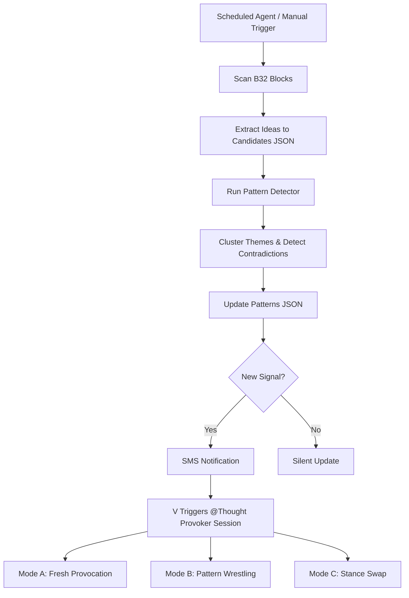

# Thought Provoker V2

```yaml
# Zone 2: Capability metadata (machine-readable)
capability_id: thought-provoker-v2
name: Thought Provoker V2
category: internal
status: active
confidence: high
last_verified: '2026-01-09'
tags: [intelligence, meetings, reflection, pattern-detection]
owner: V
purpose: |
  Automates the extraction of high-signal ideas from meeting B32 blocks and performs cross-meeting pattern detection to surface recurring themes, contradictions, and evolving positions.
components:
  - N5/scripts/thought_provoker_scan_v2.py
  - N5/scripts/thought_provoker_patterns.py
  - N5/data/provocation_candidates_v2.json
  - N5/data/provocation_patterns.json
  - Prompts/Thought Provoker Session.prompt.md
operational_behavior: |
  A daily scheduled agent scans the last 14 days of B32 meeting blocks, clusters ideas by semantic similarity, and generates a pattern report. If new provocations or significant patterns are detected, the system notifies V via SMS to initiate a reflection session.
interfaces:
  - prompt: "@Thought Provoker Session"
  - script: "python3 N5/scripts/thought_provoker_scan_v2.py"
  - script: "python3 N5/scripts/thought_provoker_patterns.py"
  - agent: "409a4bf8-579c-4351-8b1d-b5759feae481"
quality_metrics: |
  Extraction accuracy across multiple B32 formats; semantic similarity threshold >0.8 for theme detection; presence of valid contradiction/evolution signals in pattern report.
```

## What This Does

Thought Provoker V2 is a second-generation intelligence system that shifts the source of creative and strategic friction from generic email scanning to specific meeting-generated provocations (`B32_THOUGHT_PROVOKING_IDEAS.md`). It exists to ensure that unique insights captured during high-stakes conversations aren't lost to the archive, but are instead synthesized into V's evolving worldview. By tracking themes across multiple meetings, it identifies where V's thinking is converging, where he is contradicting himself, and how his positions on key topics like AI, hiring, and company strategy are shifting over time.

## How to Use It

- **Daily Reflection:** The system is primarily used via the `@Thought Provoker Session` prompt. When triggered, it loads the latest candidates and patterns to guide a Socratic dialogue.
- **Manual Scan:** To refresh the candidate pool manually, run `python3 N5/scripts/thought_provoker_scan_v2.py`. Use the `--all` flag to re-process the entire meeting history.
- **Pattern Analysis:** To generate a new cross-meeting report, run `python3 N5/scripts/thought_provoker_patterns.py`. This will update the underlying JSON data used by the session prompt.
- **Scheduled Agent:** The system runs automatically at 8:00 AM daily. If a high-signal "Pattern Challenge" or "Fresh Provocation" is found, an SMS notification is sent to prompt a morning session.

## Associated Files & Assets

- **Scanning Engine:** `file 'N5/scripts/thought_provoker_scan_v2.py'`
- **Pattern Detection:** `file 'N5/scripts/thought_provoker_patterns.py'`
- **Extracted Candidates:** `file 'N5/data/provocation_candidates_v2.json'`
- **Pattern Intelligence:** `file 'N5/data/provocation_patterns.json'`
- **Primary Interface:** `file 'Prompts/Thought Provoker Session.prompt.md'`

## Workflow

The system follows a three-stage pipeline: extraction, detection, and engagement.



## Notes / Gotchas

- **B32 Formatting:** The scanner is built to be resilient but performs best when B32 blocks follow a standard (Title: Provocation) format. Bulleted lists are supported but may yield less granular titles.
- **Time Windows:** While the scanner defaults to a 14-day window for "fresh" ideas, the pattern detector looks at the all-time history of B32 files to ensure long-range evolution tracking.
- **Semantic Noise:** High similarity scores (>0.8) usually indicate a strong recurring theme, but manual review in the Session Prompt is used to filter out noise from generic business terminology.
- **Output Storage:** Results of reflection sessions are typically captured to content-fodder or "unresolved contradictions" for future synthesis.

2026-01-09 03:42:00 ET