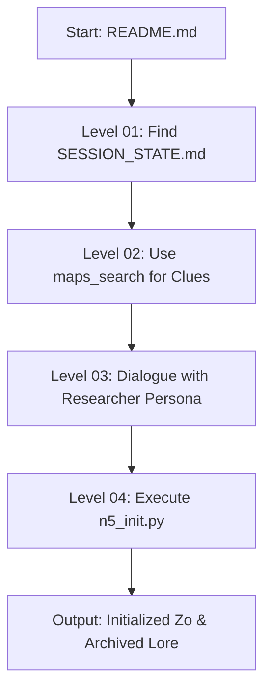

# Vibe Arg

```yaml
# Zone 2: Capability metadata (machine-readable)
capability_id: vibe-arg
name: Vibe Arg
category: internal
status: active
confidence: high
last_verified: '2026-01-09'
tags: [onboarding, gamification, lore, n5-init]
owner: V
purpose: |
  An interactive, 20-minute Holmesian mystery (ARG) designed to onboard new users by teaching core Zo and N5 system capabilities through a narrative solve path.
components:
  - N5/builds/vibe-arg/PLAN.md
  - N5/scripts/n5_init.py
  - Knowledge/Onboarding/Zo_Power_User_Guide.md
  - SESSION_STATE.md
  - N5/scripts/debug_logger.py
operational_behavior: |
  Operates as a "flashed" repository state where users follow a scripted narrative path—Level 01 (Navigation), Level 02 (Tools), Level 03 (Personas), and Level 04 (Initialization)—to unlock a fully configured Zo environment.
interfaces:
  - README.md (Initial Entry)
  - n5_init.py (System Unlock/Cleanup)
  - Research Persona (Narrative Guidance)
quality_metrics: |
  - Completion of full solve path within 20 minutes.
  - Successful execution of n5_init.py resulting in a cleaned workspace and configured user profile.
  - Verification of tool usage (maps_search) and persona switching during the session.
```

## What This Does

Vibe Arg (ZoarG) is a narrative-driven onboarding engine that transforms the initial "blank slate" experience of a new Zo into a lightweight Alternate Reality Game. It exists to solve the friction of learning complex N5 structures and tool patterns by framing them as clues in a mystery left by a "Self-Actualized" researcher. By the time the user solves the mystery, they have inadvertently learned how to navigate subdirectories, use API tools, interact with specialized personas, and initialize their own system settings.

## How to Use It

The experience is triggered automatically upon first entry into a ZoarG-flashed repository.

- **Initial Entry:** Read the root `README.md` to receive the researcher's first message and objective.
- **Level 01:** Navigate to `SESSION_STATE.md` and standard N5 subdirectories to find fragments of the "Manifesto."
- **Level 02:** Use the `maps_search` tool to resolve cryptic location data found in the researcher's notes.
- **Level 03:** Activate and converse with the **Researcher** persona to synthesize gathered journal entries.
- **Level 04:** Run the final command or provide Name/Bio details to trigger `n5_init.py`, which archives the ARG lore and transitions the system to a clean, productive state.

## Associated Files & Assets

- file 'README.md' - The starting point of the mystery.
- file 'N5/scripts/n5_init.py' - The graduation script that sets up the user profile.
- file 'SESSION_STATE.md' - Used for teaching state management and history.
- file 'Knowledge/Onboarding/Zo_Power_User_Guide.md' - The "Public" manual containing hidden clues.
- file 'N5/scripts/debug_logger.py' - Modified to provide narrative "glitch" feedback.

## Workflow

The execution flow follows the "Bequeathal" solve path, moving from system discovery to final personalization.



## Notes / Gotchas

- **Haiku Optimization:** The narrative and logic are specifically tuned for Claude Haiku; using more complex models may bypass certain puzzle constraints too easily.
- **P15 Safety:** Ensure `n5_init.py` does not delete user-created files during the cleanup phase; it should only archive the `vibe-arg` specific lore and artifacts.
- **Preconditions:** The system must have `maps_search` capability active for Level 02 to be solvable.
- **One-Way Transition:** Once `n5_init.py` is run, the ARG state is archived. Reverting requires a system restore or manual unarchiving of the `Knowledge/Xeno/` directory.

03:41:45 PM ET