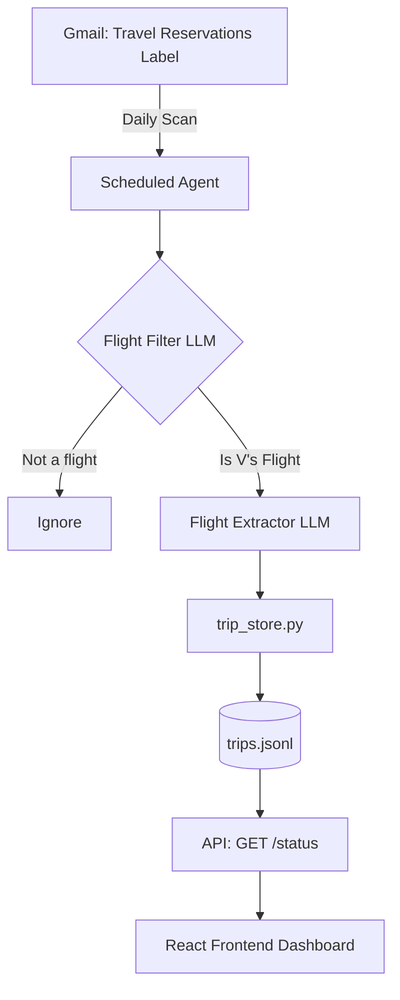

# Wheres V Revamp V2

```yaml
# Zone 2: Capability metadata (machine-readable)
capability_id: wheres-v-revamp-v2
name: Wheres V Revamp V2
category: internal
status: active
confidence: high
last_verified: '2026-01-19'
tags: [travel, tracking, automation, gmail]
owner: V
purpose: |
  Automated travel tracking system that scans Gmail for flight confirmations and presents a simplified, parent-friendly status dashboard.
components:
  - N5/builds/wheres-v-multi-segment/PLAN.md
  - Sites/wheres-v-staging/data/trips_v2.jsonl
  - Sites/wheres-v-staging/data/legs_v2.jsonl
  - Sites/wheres-v-staging/scripts/trip_store_v2.py
  - Sites/wheres-v-staging/scripts/ingest_trips.py
  - Sites/wheres-v-staging/src/App.tsx
  - Sites/wheres-v-staging/server.ts
operational_behavior: |
  A daily scheduled agent scans the "Travel Reservations" Gmail label. It uses a tiered LLM approach to filter for V's flights and extract structured details into a JSONL store, which feeds a single-page React status dashboard.
interfaces:
  - GET /api/status: Returns current status, flight, and ETA.
  - wheres-v-agent: Daily scheduled task (6 AM ET) for email ingestion.
  - https://wheres-v-va.zocomputer.io: Public-facing status dashboard.
quality_metrics: |
  Success is defined by zero-manual-entry flight tracking, 100% extraction accuracy from supported carriers, and a simplified frontend showing only essential status info for non-technical users.
```

## What This Does

Where's V Revamp V2 is a simplified travel status tracker designed for family members to easily check V's current location and upcoming travel plans. It replaces a complex management UI with a read-only, automated dashboard that extracts flight data directly from Gmail via the "Travel Reservations" label. By leveraging a tiered LLM approach, it handles the high variability of airline confirmation emails without requiring fragile regex-based parsing.

## How to Use It

- **For Parents/Users:** Simply visit the live dashboard at [https://wheres-v-va.zocomputer.io](https://wheres-v-va.zocomputer.io) to see V's current status, flight details, and estimated time of arrival.
- **For V (Developer):**
    - **Automation:** The system runs automatically every day at 6:00 AM ET via a scheduled Zo agent.
    - **Manual Trigger:** To force an update, run the `wheres-v-agent` task or execute the ingestion scripts located in `file 'Sites/wheres-v-staging/scripts/'`.
    - **API Access:** Status data can be retrieved programmatically via `GET /api/status`.

## Associated Files & Assets

- `file 'Sites/wheres-v-staging/data/trips.jsonl'` — The canonical flat-file database for trip records.
- `file 'Sites/wheres-v-staging/scripts/trip_store.py'` — Logic for managing trip data persistence and updates.
- `file 'Prompts/wheres-v/flight_filter.prompt.md'` — Fast-tier LLM prompt used to identify relevant flight emails.
- `file 'Prompts/wheres-v/flight_extractor.prompt.md'` — Smart-tier LLM prompt for precise extraction of departure, arrival, and flight numbers.
- `file 'Sites/wheres-v-staging/src/App.tsx'` — Simplified React frontend for the status display.
- `file 'Sites/wheres-v-staging/server/api.ts'` — Hono-based API server providing the status endpoint.

## Workflow

The system operates on a "Pull-Analyze-Serve" model, moving data from V's inbox to a simplified JSONL store and finally to the web interface.



## Notes / Gotchas

- **Preconditions:** Emails must be labeled with "Travel Reservations" (Label_4999101574974696630) to be picked up by the agent.
- **Lookback Window:** The agent scans the last 7 days of emails to ensure no bookings are missed if the agent fails to run for a day.
- **Disambiguation:** The LLM prompts are specifically tuned to distinguish between V's actual travel and marketing emails or bookings for other people.
- **Staging vs. Prod:** Development happens in `file 'Sites/wheres-v-staging/'`. Deployment to the live URL involves promoting these changes to the production service.