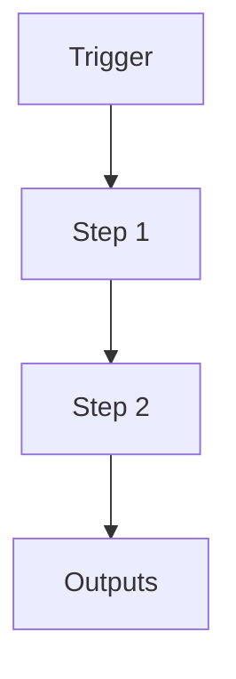

# Worker Prompts (Inverted Intelligence)

```yaml
# Zone 2: Capability metadata (machine-readable)
capability_id: worker-prompts
name: Worker Prompts (Inverted Intelligence)
category: internal
status: active
confidence: high
last_verified: 2025-12-11
tags:
- prompts
- workers
entry_points:
- type: prompt
  id: Prompts/Workers/general_worker.prompt.md
owner: V
change_type: new
description: 'Library of externalized worker instructions (build, research, writer,
  etc.) loaded by n5_launch_worker.

  '
associated_files:
- Prompts/Workers/build_worker.prompt.md
- Prompts/Workers/research_worker.prompt.md
- Prompts/Workers/writer_worker.prompt.md
- Prompts/Workers/analysis_worker.prompt.md
- Prompts/Workers/general_worker.prompt.md
```

## What This Does

Library of externalized worker instructions (build, research, writer, etc.) loaded by n5_launch_worker.

## How to Use It

- How to trigger it (prompts, commands, UI entry points)
- Typical usage patterns and workflows

## Associated Files & Assets

List key implementation and configuration files using `file '...'` syntax where helpful.

## Workflow

Describe the execution flow. Optionally include a mermaid diagram.



## Notes / Gotchas

- Edge cases
- Preconditions
- Safety considerations
