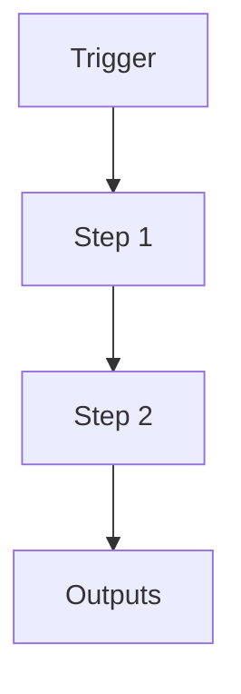

# Worker Verification (Semantic Gatekeeper)

```yaml
# Zone 2: Capability metadata (machine-readable)
capability_id: worker-verification
name: Worker Verification (Semantic Gatekeeper)
category: internal
status: active
confidence: high
last_verified: 2025-12-11
tags:
- verification
- safety
- quality
entry_points:
- type: script
  id: N5/scripts/n5_verify_completion.py
owner: V
change_type: new
description: 'Semantic Gatekeeper script to verify artifact existence and syntax validity
  before allowing worker submission.

  '
associated_files:
- N5/scripts/n5_verify_completion.py
```

## What This Does

Semantic Gatekeeper script to verify artifact existence and syntax validity before allowing worker submission.

## How to Use It

- How to trigger it (prompts, commands, UI entry points)
- Typical usage patterns and workflows

## Associated Files & Assets

List key implementation and configuration files using `file '...'` syntax where helpful.

## Workflow

Describe the execution flow. Optionally include a mermaid diagram.



## Notes / Gotchas

- Edge cases
- Preconditions
- Safety considerations
