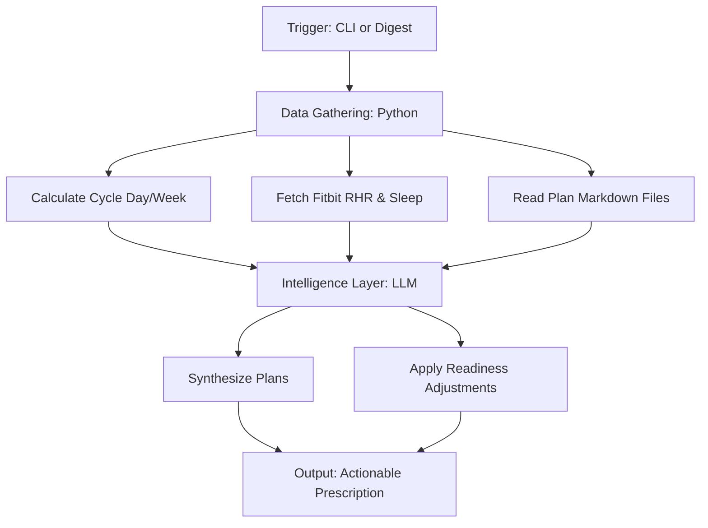

# Workout Prescription Engine

```yaml
# Zone 2: Capability metadata (machine-readable)
capability_id: workout-prescription-engine
name: Workout Prescription Engine
category: internal
status: active
confidence: high
last_verified: '2026-01-09'
tags: [health, fitness, fitbit, automated-prescription]
owner: V
purpose: |
  Synthesize V's 10K Training Plan and Jair Lee Strength Program into a single daily workout prescription, dynamically adjusted based on Fitbit readiness data.
components:
  - N5/builds/workout-prescription-engine/PLAN.md
  - Personal/Health/WorkoutTracker/workout_prescriber.py
  - Personal/Health/WorkoutTracker/10K_Prep_Plan.md
  - Personal/Health/WorkoutTracker/Jair-Lee-Training-Program-Phase1.md
  - Personal/Health/workouts.db
operational_behavior: |
  The engine calculates the current position in the training cycle, gathers biometric readiness data (RHR, sleep) from workouts.db, and uses an LLM to synthesize the primary 10K plan with secondary strength details from the Jair Lee program. It then applies adjustment rules to modify workout intensity or duration based on the calculated readiness score.
interfaces:
  - CLI: python3 Personal/Health/WorkoutTracker/workout_prescriber.py [date] [--status] [--data-only]
  - DB: workouts.db (training_cycle and daily_prescription tables)
quality_metrics: |
  Success is defined by the generation of a daily prescription that accurately reflects the cycle day, correctly integrates the specific strength focus from the Jair Lee plan on designated days, and applies intensity reductions when readiness scores fall below 80.
```

## What This Does

The Workout Prescription Engine serves as the central intelligence layer for V's physical training. It exists to remove the cognitive load of deciding "what to do today" by automatically merging two distinct training protocols: a primary 10K preparation plan and the Jair Lee strength program. By monitoring real-time biometric signals—specifically resting heart rate (RHR) and sleep quality from Fitbit—the engine ensures that training intensity matches V's physical capacity, recommending active recovery or full rest when readiness is compromised.

## How to Use It

This capability is primarily used via the command line on Zo Computer.

- **Daily Prescription**: To get your workout for today, run:
  `python3 Personal/Health/WorkoutTracker/workout_prescriber.py`
- **Future Planning**: To see the prescription for a specific date:
  `python3 Personal/Health/WorkoutTracker/workout_prescriber.py YYYY-MM-DD`
- **Cycle Status**: To check your current week and day in the training cycle without generating a full prescription:
  `python3 Personal/Health/WorkoutTracker/workout_prescriber.py --status`
- **Debug Mode**: To view the raw biometric and cycle data being fed into the engine:
  `python3 Personal/Health/WorkoutTracker/workout_prescriber.py --data-only`

## Associated Files & Assets

- `file 'Personal/Health/WorkoutTracker/workout_prescriber.py'` — The core execution script.
- `file 'Personal/Health/WorkoutTracker/10K_Prep_Plan.md'` — The primary cardio and schedule source.
- `file 'Personal/Health/WorkoutTracker/Jair-Lee-Training-Program-Phase1.md'` — The secondary strength focus source.
- `file 'Personal/Health/workouts.db'` — SQLite database containing cycle state and historical Fitbit data.
- `file 'N5/builds/workout-prescription-engine/PLAN.md'` — Original architectural plan.
- `file 'N5/builds/workout-prescription-engine/STATUS.md'` — Implementation status and history.

## Workflow

The engine follows a "Data -> Intelligence -> Prescription" flow to generate daily results.



## Notes / Gotchas

- **Cycle Start**: The engine is calibrated to a cycle start date of **2026-01-04**.
- **Readiness Sensitivity**: The engine heavily weights RHR (40% of score). If your RHR is significantly above its 14-day baseline, expect the engine to automatically downgrade your workout to active recovery or rest, regardless of the plan.
- **Source Truth**: If the markdown files for the 10K or Jair Lee plans are edited, the engine will pick up the changes immediately on the next run.
- **Database Dependency**: The script requires `workouts.db` to be populated with recent Fitbit data. If data is missing for the last 24-48 hours, readiness calculations may default to "Full Prescription" or fail.

09 Jan 2026 03:42 AM EST