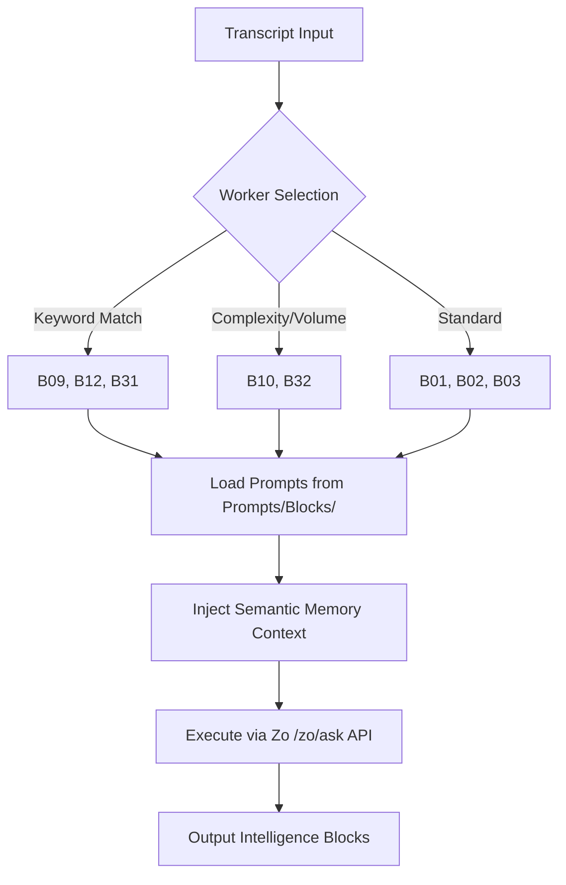

# Block Prompt Consolidation

```yaml
# Zone 2: Capability metadata (machine-readable)
capability_id: block-prompt-consolidation
name: Block Prompt Consolidation
category: prompt
status: active
confidence: high
last_verified: '2026-01-09'
tags: [n5, meeting-intelligence, prompts, infrastructure]
owner: V
purpose: |
  Consolidates meeting intelligence block prompts into a Single Source of Truth (SSOT) at `Prompts/Blocks/` to eliminate drift and enable semantic memory features.
components:
  - N5/workers/worker_generate_blocks.py
  - Prompts/Blocks/
  - N5/builds/block-prompt-consolidation/PLAN.md
operational_behavior: |
  The worker script dynamically maps block codes to standardized prompt files in `Prompts/Blocks/`, selects relevant blocks based on keyword triggers and semantic context, and executes them via the Zo `/zo/ask` API with semantic memory enrichment.
interfaces:
  - worker: python3 N5/workers/worker_generate_blocks.py
  - prompt_registry: Prompts/Blocks/Generate_B*.prompt.md
quality_metrics: |
  100% resolution of block codes to Prompts/Blocks/ location; successful YAML frontmatter parsing; successful semantic memory injection for B07/B08 blocks.
```

## What This Does

This capability centralizes the meeting intelligence extraction system by moving all block-generation prompts to `Prompts/Blocks/`. By establishing this Single Source of Truth, it eliminates version drift between system workers and user-invokable prompts. It also introduces sophisticated trigger logic for new block types (B09–B32) and integrates semantic memory, allowing the system to reference prior meeting history and CRM data during the generation process.

## How to Use It

This capability is primarily handled by the system infrastructure but can be influenced or used manually:

- **Automated Processing**: The system triggers this via `python3 N5/workers/worker_generate_blocks.py` during the `meeting-process` workflow. It automatically selects blocks like B09 (Collaboration Terms) or B12 (Technical Infrastructure) based on transcript keywords.
- **Manual Invocation**: Any consolidated prompt can be called directly in chat using the `@` symbol (e.g., `@Generate_B08`) to regenerate specific intelligence blocks for a meeting.
- **Prompt Management**: To update how a block is generated, edit the corresponding file in `file 'Prompts/Blocks/'`.

## Associated Files & Assets

- `file 'N5/workers/worker_generate_blocks.py'`: The primary execution engine that loads and runs the prompts.
- `file 'Prompts/Blocks/'`: The canonical directory containing all `Generate_BXX.prompt.md` files.
- `file 'N5/.archive_block_prompts_20260103/'`: Archive of the legacy block prompt location to prevent accidental usage of outdated templates.

## Workflow

The execution flow ensures that only relevant, memory-enriched intelligence is generated for every meeting transcript.



## Notes / Gotchas

- **SSOT Enforcement**: Never edit prompts in `N5/prompts/blocks` as this directory is archived; changes there will not be reflected in the processing pipeline.
- **Fallback Logic**: The system includes a fallback to the Anthropic API if the primary Zo API is unavailable, though semantic memory features are optimized for the Zo environment.
- **Keyword Triggers**: Block selection is sensitive to transcript quality; ensure transcripts are normalized before processing to ensure keyword triggers (like "API", "partnership", or "agreement") are correctly detected.
- **Memory Dependencies**: Blocks like B07 and B08 require an active `N5MemoryClient` connection; if the memory service is down, these blocks will generate with standard context only.

2026-01-09 03:45:15 ET