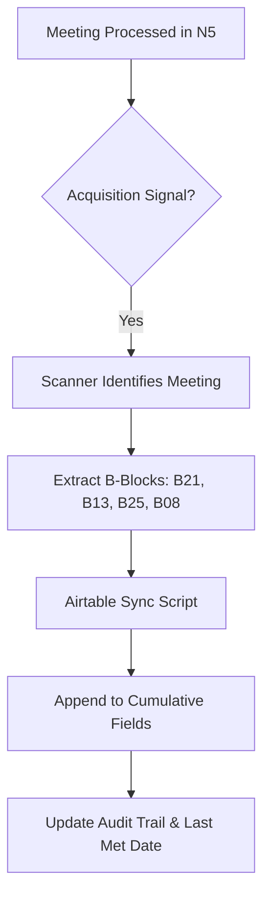

# Acquisition Tracker

```yaml
# Zone 2: Capability metadata (machine-readable)
capability_id: acquisition-tracker
name: Acquisition Tracker
category: site
status: active
confidence: high
last_verified: '2026-01-09'
tags: [airtable, m&a, ingestion, automation]
owner: V
purpose: |
  Automatically syncs qualitative acquisition deal intelligence from N5 meeting transcripts to a structured Airtable base for Careerspan.
components:
  - file 'N5/builds/acquisition-tracker/PLAN.md'
  - file 'N5/scripts/airtable_config.py'
  - file 'N5/scripts/airtable_deal_sync.py'
  - file 'N5/scripts/acquisition_deal_scanner.py'
operational_behavior: |
  Scans meeting folders for acquisition signals (manual or semantic), extracts B-block intelligence (B21, B13, B25, B08), and appends it to cumulative text fields in Airtable.
interfaces:
  - type: script
    entry: python3 N5/scripts/acquisition_deal_scanner.py
  - type: agent
    entry: Acquisition Deal Tracking (Daily 8:00 AM ET)
quality_metrics: |
  100% sync rate for flagged meetings; cumulative context preserved in append-only fields; no overwriting of historical relationship notes.
```

## What This Does

The Acquisition Tracker is a bridging system designed to capture high-signal M&A intelligence from Careerspan meetings and centralize it in Airtable. Unlike traditional trackers that focus on financials, this capability prioritizes qualitative relationship signals, strategic fit, and risk accumulation. It transforms unstructured transcript data into a structured deal log, ensuring that every interaction with a potential acquisition target builds a cumulative knowledge base rather than existing as an isolated event.

## How to Use It

This capability operates primarily as an automated background process, but can be managed via the following interfaces:

- **Automated Sync**: A daily scheduled agent runs at 8:00 AM ET to scan for new meetings and sync intelligence to Airtable.
- **Manual Trigger**: To force a sync of a specific meeting or run a discovery scan, execute:
  `python3 N5/scripts/acquisition_deal_scanner.py`
- **Trigger Logic**: The system identifies deals through a hybrid approach:
  - **Manual**: Tagging a meeting with acquisition-related keywords.
  - **Semantic**: The system detects "Acquisition Signals" within N5 intelligence blocks (e.g., discussions about strategic fit or partnership synergies).

## Associated Files & Assets

- file 'N5/scripts/airtable_config.py': Central configuration for Airtable Base and Table IDs.
- file 'N5/scripts/airtable_deal_sync.py': The core ingestion engine that maps N5 B-blocks to Airtable fields.
- file 'N5/scripts/acquisition_deal_scanner.py': The orchestrator responsible for identifying unprocessed meetings.
- file 'N5/builds/acquisition-tracker/PLAN.md': The original architectural specification and schema design.
- file 'N5/builds/acquisition-tracker/STATUS.md': Current implementation status and activity log.

## Workflow

The system follows an append-only logic to ensure no intelligence is lost over the course of a deal lifecycle.



## Notes / Gotchas

- **Qualitative Focus**: This system does not track deal valuation or financial modeling; it is strictly for relationship and strategic intelligence.
- **Append-Only Fields**: Airtable fields for "Strategic Fit," "Key Moments," and "Risks" are configured as long-text fields. The script appends new meeting notes with a datestamp to preserve history.
- **Preconditions**: Meetings must have generated intelligence blocks (standard N5 processing) before they can be synced to Airtable.
- **Deduplication**: The `Meeting Audit` table prevents the same meeting from being ingested multiple times.