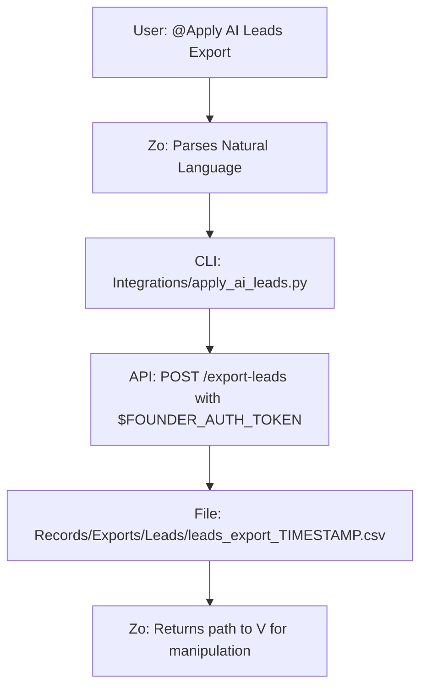

# Apply Ai Leads Export

```yaml
# Zone 2: Capability metadata (machine-readable)
capability_id: apply-ai-leads-export
name: Apply Ai Leads Export
category: site
status: active
confidence: high
last_verified: '2026-01-09'
tags: [leads, export, apply-ai, recruitment]
owner: V
purpose: |
  Integrates the Apply AI Export Employer Leads API with a CLI tool and natural language interface to enable easy retrieval and manipulation of employer lead data.
components:
  - file 'Integrations/apply_ai_leads.py'
  - file 'Prompts/Apply AI Leads Export.prompt.md'
  - file 'Records/Exports/Leads/'
  - file 'N5/builds/apply-ai-leads-export/PLAN.md'
operational_behavior: |
  Retrieves CSV data from the Apply AI endpoint via a Python CLI wrapper that handles authentication ($FOUNDER_AUTH_TOKEN) and saves timestamped exports to a canonical workspace directory.
interfaces:
  - prompt: "@Apply AI Leads Export"
  - cli: "python3 Integrations/apply_ai_leads.py"
quality_metrics: |
  Successful CSV retrieval, file organization in Records/Exports/Leads/, and natural language trigger functionality.
```

## What This Does

This capability provides a streamlined bridge between the Apply AI backend and the Zo workspace for employer lead management. It allows V to programmatically or conversationally export employer lead and applicant data into CSV format, abstracting away the complexities of API authentication and file pathing. This exists to facilitate rapid data retrieval for further analysis, manipulation, or reporting within the Careerspan ecosystem.

## How to Use It

### Prompts
Invoke the natural language interface by mentioning the prompt in chat:
- `@Apply AI Leads Export last 7 days`
- `@Apply AI Leads Export for employer hr@acme.com`
- `@Apply AI Leads Export last 30 days for recruiter@startup.co`

### Commands
Run the CLI tool directly from the terminal for more granular control:
`python3 Integrations/apply_ai_leads.py --days [N] --employer-email [EMAIL] --output [PATH]`

## Associated Files & Assets

- CLI Implementation: file 'Integrations/apply_ai_leads.py'
- Natural Language Entry Point: file 'Prompts/Apply AI Leads Export.prompt.md'
- Export Repository: file 'Records/Exports/Leads/'
- Build Documentation: file 'N5/builds/apply-ai-leads-export/PLAN.md'

## Workflow



## Notes / Gotchas

- **Authentication:** Requires `FOUNDER_AUTH_TOKEN` to be set in the environment. If expired, the tool will return a 401 Unauthorized error.
- **Timeouts:** Due to potential Modal cold starts, the script includes a 30-second timeout.
- **Data Volume:** While optimized for standard exports, requests exceeding 90 days of data may trigger a volume warning in the console.
- **Storage:** All exports are automatically saved to file 'Records/Exports/Leads/' using a timestamped naming convention to prevent overwriting.

2026-01-09 03:41:45 ET