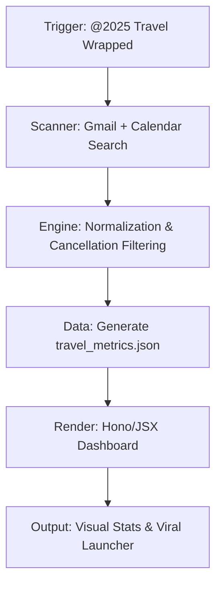

# Travel Wrapped 2025

```yaml
# Zone 2: Capability metadata (machine-readable)
capability_id: travel-wrapped-2025
name: Travel Wrapped 2025
category: site
status: active
confidence: high
last_verified: '2026-01-09'
tags: [travel, visualization, gmail, calendar, dashboard]
owner: V
purpose: |
  Generates a high-fidelity visual summary of 2025 travel history by synthesizing Gmail confirmations and Calendar events into a "Wrapped" style dashboard.
components:
  - N5/builds/travel-wrapped-2025/PLAN.md
  - N5/builds/travel-wrapped-2025/engine.py
  - Travel Wrapped/2025/travel_metrics.json
  - travel-wrapped-2025/src/pages/travel-wrapped.tsx
  - Prompts/2025 Travel Wrapped.prompt.md
operational_behavior: |
  Scans Gmail for airline and aggregator confirmations, corroborates data with Google Calendar events, normalizes airport/city data (including NYC hub grouping), and renders a local Hono/JSX dashboard.
interfaces:
  - prompt: "@2025 Travel Wrapped"
  - site: travel-wrapped-2025
  - script: python3 N5/builds/travel-wrapped-2025/engine.py
quality_metrics: |
  100% exclusion of cancelled segments; deterministic manifest verification against raw events; segment-level accuracy for JetBlue, United, and Delta.
```

## What This Does

Travel Wrapped 2025 is a data visualization system that reconstructs your year in travel with high precision. It moves beyond simple email counting by implementing a "segment-first" logic that filters out cancellations, groups New York City hubs (JFK/LGA/EWR), and corroborates Gmail data with Calendar entries to capture trips booked through external portals. The system produces a "viral-ready" infographic dashboard featuring city/airport rankings, time-of-day travel insights, and "funny" stats like rebooking counts.

## How to Use It

- **Prompt Trigger:** Mention the `@2025 Travel Wrapped` prompt to initiate a fresh scan of your Gmail and Calendar.
- **CLI Execution:** Run the engine manually via `python3 N5/builds/travel-wrapped-2025/engine.py` to regenerate `travel_metrics.json`.
- **UI Entry Point:** Access the local dashboard by navigating to the `travel-wrapped-2025` site in your [Sites](/sites) dashboard to view the rendered cards and tables.

## Associated Files & Assets

- **Engine:** file 'N5/builds/travel-wrapped-2025/engine.py'
- **Metrics Data:** file 'Travel Wrapped/2025/travel_metrics.json'
- **UI Template:** file 'travel-wrapped-2025/src/pages/travel-wrapped.tsx'
- **Audit Manifest:** file 'N5/builds/travel-wrapped-2025/comprehensive_manifest.md'
- **Primary Prompt:** file 'Prompts/2025 Travel Wrapped.prompt.md'

## Workflow



## Notes / Gotchas

- **Home Grouping:** All flights to/from JFK, LGA, and EWR are normalized to "New York" for city-level stats to prevent fragmentation of home-base data.
- **Cancellation Policy:** The segment count strictly excludes any email thread containing a cancellation confirmation unless a subsequent re-confirmation is detected.
- **Confidence Flags:** Time-of-day insights (morning/evening mode) use email timestamps as a proxy if explicit flight times are missing, which may result in a "low-confidence" flag in the manifest.
- **Privacy:** All scanning and processing happen locally on Zo; no raw travel data is sent to external APIs during the rendering phase.

2026-01-09 03:40:00 ET