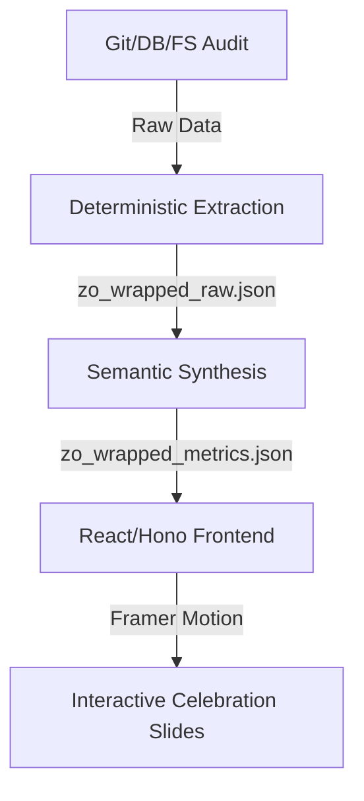

# Zo Wrapped

```yaml
# Zone 2: Capability metadata (machine-readable)
capability_id: zo-wrapped
name: Zo Wrapped
category: site
status: active
confidence: high
last_verified: '2026-01-09'
tags: ["analytics", "visualization", "year-in-review", "sites"]
owner: V
purpose: |
  Provides a slide-based, interactive end-of-year celebration of workspace growth, technical activity, and AI collaboration metrics.
components:
  - N5/scripts/zo_wrapped/extract_stats.py
  - N5/scripts/zo_wrapped/synthesize_vibe.py
  - N5/data/zo_wrapped_metrics.json
  - Sites/zo-wrapped-2025/
operational_behavior: |
  Extracts deterministic metrics from Git logs, conversation databases, and filesystem growth, then synthesizes semantic 'vibes' (e.g., Persona distribution, monthly themes) into a JSON payload consumed by a Hono-based Framer Motion frontend.
interfaces:
  - prompt: "@Zo Wrapped"
  - command: "python3 N5/scripts/zo_wrapped/extract_stats.py"
  - URL: "/sites#zo-wrapped-2025"
quality_metrics: |
  - Accurate LoC/Thread/Token counts verified against source databases.
  - Narrative alignment with 'Technical Boundary Pushing' theme.
  - Interactive slide transitions loading in under 2 seconds.
```

## What This Does

Zo Wrapped is an automated year-in-review engine that transforms raw workspace activity into a high-fidelity visual narrative. It audits Git contributions, conversation history, and filesystem expansion to celebrate V's technical progress throughout the year. By synthesizing hard data (Lines of Code, file counts) with semantic analysis (Persona usage, project milestones), it provides a "Spotify Wrapped" style experience for the user's digital ecosystem.

## How to Use It

- **Dashboard Access:** Navigate to the `Sites/` section of the Zo app and open the `zo-wrapped-2025` service to view the interactive slides.
- **Manual Data Refresh:** To force an update of the underlying metrics, run the extraction and synthesis scripts:
  - `python3 N5/scripts/zo_wrapped/extract_stats.py`
  - `python3 N5/scripts/zo_wrapped/synthesize_vibe.py`
- **UI Entry Point:** Access via the local URL registered for the `zo-wrapped-2025` user service.

## Associated Files & Assets

- File 'N5/scripts/zo_wrapped/extract_stats.py' - The deterministic data extraction engine.
- File 'N5/scripts/zo_wrapped/synthesize_vibe.py' - The semantic analysis and trend identification layer.
- File 'N5/data/zo_wrapped_metrics.json' - The canonical data source for the frontend.
- File 'Sites/zo-wrapped-2025/src/pages/Wrapped.tsx' - The primary React/Framer Motion slide component.
- File 'N5/builds/zo-wrapped/PLAN.md' - The historical build plan and architecture notes.

## Workflow

The system operates in a linear pipeline from raw data to visual presentation.



## Notes / Gotchas

- **Scan Performance:** Scanning the entire workspace for Git stats can be resource-intensive; the script is optimized to focus only on `Sites/`, `N5/`, and `Projects/`.
- **Token Estimation:** Since raw billing data is not always accessible, token counts are deterministically estimated using `tiktoken` against the `conversations.db` history.
- **Preconditions:** Requires the `zo-wrapped-2025` user service to be active and the metrics JSON to be populated in `N5/data/`.