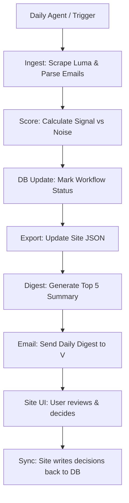

# Events Pipeline Consolidation

```yaml
# Zone 2: Capability metadata (machine-readable)
capability_id: events-pipeline-consolidation
name: Events Pipeline Consolidation
category: workflow
status: active
confidence: high
last_verified: '2026-01-09'
tags: [events, luma, automation, pipeline]
owner: V
purpose: |
  Unify the bifurcated events tracking system into a single automated pipeline with bidirectional synchronization between the events site and the Luma database.
components:
  - file 'N5/scripts/luma_unified_pipeline.py'
  - file 'N5/scripts/luma_digest.py'
  - file 'N5/scripts/sync_decisions_to_db.py'
  - file 'N5/data/luma_events.db'
  - file 'Sites/events-calendar-staging/server.ts'
  - file 'N5/builds/events-pipeline-consolidation/PLAN.md'
operational_behavior: |
  Runs as a daily orchestrator that handles the end-to-end lifecycle of an event: discovery via scraping/email parsing, automated scoring, database updates, and digest generation for daily review.
interfaces:
  - CLI: python3 N5/scripts/luma_unified_pipeline.py
  - CLI: python3 N5/scripts/luma_digest.py --days 7 --top 5
  - API: POST /api/sync (Events Site → DB)
  - Agent: Daily Events Pipeline (8am ET)
quality_metrics: |
  1. Completion of full pipeline (Discovery -> Email) in a single run.
  2. Successful sync of UI decisions back to the SQLite source of truth.
  3. Reliability of digest emails with accurate scoring badges.
```

## What This Does

This capability consolidates what was previously a fragmented set of six different scripts and agents into a unified event intelligence pipeline. It exists to ensure V has a single, reliable source of truth for Luma events, eliminating the gap between the event alerts received and the site used to track them. By automating discovery, scoring, and digest generation, it reduces manual overhead and ensures high-signal events are never missed.

## How to Use It

### Automated Execution
The pipeline is primarily driven by the **Daily Events Pipeline** agent, which runs at 8:00 AM ET. This agent executes the unified orchestrator to refresh the database and send the daily digest.

### Manual Commands
You can trigger specific parts of the pipeline or the full flow using these scripts:

- **Run Full Pipeline:**
  `python3 N5/scripts/luma_unified_pipeline.py`
  *(Options: `--skip-scrape` to use existing data, `--dry-run` to test without sending emails)*

- **Generate Digest Only:**
  `python3 N5/scripts/luma_digest.py --days 7 --top 5 --format markdown`

- **Manual Sync:**
  `python3 N5/scripts/sync_decisions_to_db.py`
  *(Used to force a sync of decisions made on the Events Site back to the core database)*

### UI Entry Point
Access the **Events Site** (`Sites/events-calendar`) to view scored events. Decisions made in the UI (approve/reject) are automatically synced back to the database via the `/api/sync` endpoint.

## Associated Files & Assets

- file 'N5/scripts/luma_unified_pipeline.py' - The primary orchestrator.
- file 'N5/scripts/luma_digest.py' - Logic for generating the daily summary.
- file 'N5/scripts/sync_decisions_to_db.py' - Bidirectional sync utility.
- file 'N5/data/luma_events.db' - SQLite source of truth for all events.
- file 'Sites/events-calendar-staging/server.ts' - Backend handling site-to-db sync.

## Workflow

The pipeline follows a linear execution path to move events through their lifecycle stages:



## Notes / Gotchas

- **Workflow Status:** The system tracks events through five states: `new` → `scored` → `approved/rejected` → `registered`. Ensure the `workflow_status` column in file 'N5/data/luma_events.db' is respected.
- **Organizer Trust:** Scoring heavily weights "Must-go" organizers and historical trust tallies. If an event is missing a score, check the organizer's presence in the trust database.
- **Site Sync:** The bidirectional sync requires the site server to be running. If the site is down, decisions made locally in `event_decisions.json` will wait until the next `sync_decisions_to_db.py` run to reconcile with the DB.
- **Stale Data:** Events are filtered by their `start_at` timestamp; ensure the server time is synchronized to avoid dropping today's events from the digest.

03:40:00 ET