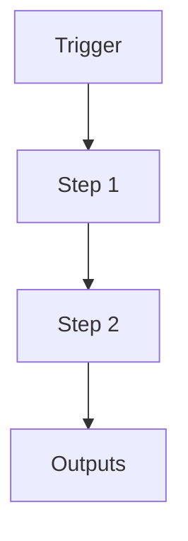

# Build Orchestrator v2

```yaml
# Zone 2: Capability metadata (machine-readable)
capability_id: build-orchestrator-v2
name: Build Orchestrator v2
category: orchestrator
status: active
confidence: high
last_verified: 2025-12-11
tags:
- build
- orchestration
- automation
entry_points:
- type: script
  id: N5/scripts/build_orchestrator_v2.py
owner: V
change_type: update
description: 'LLM-driven project coordination system. Now includes ''submit'', ''review'',
  and ''approve'' commands for the Validation Loop.

  '
associated_files:
- N5/scripts/build_orchestrator_v2.py
```

## What This Does

LLM-driven project coordination system. Now includes 'submit', 'review', and 'approve' commands for the Validation Loop.

## How to Use It

- How to trigger it (prompts, commands, UI entry points)
- Typical usage patterns and workflows

## Associated Files & Assets

List key implementation and configuration files using `file '...'` syntax where helpful.

## Workflow

Describe the execution flow. Optionally include a mermaid diagram.



## Notes / Gotchas

- Edge cases
- Preconditions
- Safety considerations
