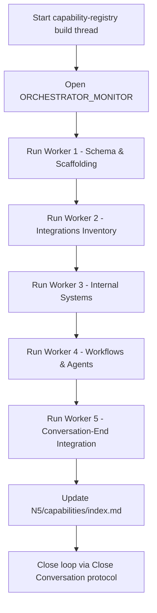

# Capability Registry v1 Orchestrator

```yaml
capability_id: capability-registry-v1-orchestrator
name: "Capability Registry v1 Orchestrator"
category: orchestrator
status: active
confidence: medium
last_verified: 2025-11-29
tags:
  - registry
  - system
  - capabilities
  - orchestration
entry_points:
  - type: script
    id: "N5/builds/capability-registry-v1/ORCHESTRATOR_MONITOR.md"
owner: "V"
```

## What This Does

Coordinates the creation and maintenance of the **N5 Capability Registry** under `N5/capabilities/`. This orchestrator defines the worker briefs and monitoring structure for documenting integrations, internal systems, workflows, agents, and orchestrators into a single, queryable registry.

## How to Use It

- Open `file 'N5/builds/capability-registry-v1/ORCHESTRATOR_MONITOR.md'` in a dedicated build conversation.
- For each worker (1–5), spin up a new build thread using the corresponding worker brief:
  - `file 'N5/builds/capability-registry-v1/WORKER_1_schema_and_scaffolding.md'`
  - `file 'N5/builds/capability-registry-v1/WORKER_2_integrations_inventory.md'`
  - `file 'N5/builds/capability-registry-v1/WORKER_3_internal_systems.md'`
  - `file 'N5/builds/capability-registry-v1/WORKER_4_workflows_and_agents.md'`
  - `file 'N5/builds/capability-registry-v1/WORKER_5_conversation_end_integration.md'`
- Use this orchestrator as the **home thread** for capability-registry work; all worker conversations should link back here.
- Once workers land their deliverables, ensure `file 'N5/capabilities/index.md'` is updated and cross-linked.

## Associated Files & Assets

- `file 'N5/builds/capability-registry-v1/ORCHESTRATOR_MONITOR.md'` – primary monitor and checklist
- `file 'N5/capabilities/CAPABILITY_TEMPLATE.md'` – schema and metadata template
- `file 'N5/capabilities/index.md'` – top-level registry index
- `file 'Prompts/Close Conversation.prompt.md'` – eventual integration point for auto-capturing capabilities from build threads

## Workflow



## Notes / Gotchas

- This orchestrator is **meta-system infrastructure**; changes here affect how all other capabilities are documented.
- Worker 5 owns wiring into the conversation-end pipeline; Worker 4 (this thread) should **not** modify Close Conversation behavior directly.
- Keep capability metadata conservative (`confidence: medium`) until workflows are stable and backfilled.
- Always update `last_verified` when validating or materially changing registry behavior.

